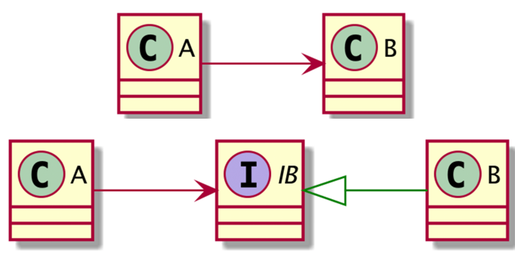

# Clean Architecture

- [The Clean Architecture from The Clean Code Blog](https://blog.cleancoder.com/uncle-bob/2012/08/13/the-clean-architecture.html)
- [The Clean Architecture 翻訳](https://blog.tai2.net/the_clean_architecture.html)


`依存性のルール`として、`ソースコードは、内側に向かってのみ依存することができる`

## このアーキテクチャーによって実現したいこと

- フレームワーク独立
- テスト可能
  - ビジネスルールは、UI、データベース、ウェブサーバー、その他外部の要素なしにテストできる
- UI 独立
  - UI は、容易に変更できる
- データベース独立
- 外部機能独立

## Layer

- 上位レベルの方針(入出力から遠い方針)は、下位レベルの方針よりも変更の頻度が低い
- 上位レベルのコンセプトは下位レベルのコンセプトのことを知らないが、下位レベルは上位レベルのことを知っている

### Enterprise Business Rules (Entities)

- エンティティは、メソッドを持ったオブジェクトかもしれないし、データ構造と関数の集合かもしれない
- 最重要ビジネスデータを操作する最重要ビネジスルールをいくつか含んだもの
- 複数のアプリケーションで使用できるように一般化されている

### Application Business Rules (Use Cases)

- アプリケーション固有のビジネスルールを含む
- アプリケーション固有のため、システムの入出力に近くなる
- ユースケースを見ただけでは、それが Web アプリケーションなのか CUI アプリケーションなのか判断はつかない
- これらのユースケースは、エンティティからの、あるいはエンティティーへのデータの流れを組み立てる
- そして、エンティティ、プロジェクトレベルのビジネスルールを使って、ユースケースの目的を達成する

### Interface Adapter (Controllers, Presenters, Gateways)

- アダプターの集合
- ユースケースとエンティティにもっとも便利な形式から、データベースやウェブのような外部の機能にもっとも便利な形式に、データを変換する
- そのため特定の Device のために、必ず存在するわけではない
- たとえば、このレイヤーは、GUI の MVC アーキテクチャを完全に内包する ([Blog](https://blog.tai2.net/the_clean_architecture.html) によると)

### Framework & Device (Web, UI, DB, Devices)

- 一般に、このレイヤーには、多くのコードは書かない

## よく使う実装は、Layer の何に該当するか？

### Repository

例えば、usecase 層があり、repository I/F に依存しているとする

```go
type SampleUsecaser interface {
  // parameter and response may be changed as specification
  DoFirst(ctx context.Context) (response.Response, error)
  DoSecond(ctx context.Context) (response.Response, error)
}

type SampleUsecase struct {
  logger   logger.Logger
  addressRepo repository.AddressRepositorier
}
```

repository Interface は以下の通り

```go
type AddressRepositorier interface {
  GetAll(accountType account.AccountType) ([]*models.Address, error)
  GetAllAddress(accountType account.AccountType) ([]string, error)
}
```

実装は以下の通り

```go
// AddressRepository is repository for address table
type AddressRepository struct {
  dbConn       *sql.DB
  tableName    string
  logger       *zap.Logger
}

// NewAddressRepository returns AddressRepository object
func NewAddressRepository(dbConn *sql.DB, logger *zap.Logger) *AddressRepository {
  return &AddressRepository{
    dbConn:       dbConn,
    tableName:    "address",
    logger:       logger,
  }
}

// GetAll returns all records by account
func (r *AddressRepository) GetAll(accountType account.AccountType) ([]*models.Address, error) {
  // sql := "SELECT * FROM %s WHERE account=%s;"
  ctx := context.Background()

  items, err := models.Addresses(
    qm.Where("coin=?", r.coinTypeCode.String()),
    qm.And("account=?", accountType.String()),
  ).All(ctx, r.dbConn)
  if err != nil {
    return nil, errors.Wrap(err, "failed to call models.Addresss().All()")
  }
  return items, nil
}
```

このとき、Repository (AddressRepository を実装した AddressRepository) は、`Interface Adapter (Controllers, Presenters, Gateways)`レイヤーに該当する。
例えば、上記の`GetAll()`は Interface を介して Usecase 層から呼ばれる。そしてこの`GetAll()`内で`models.Addresses(..).All(..)`という DB ライブラリの実装を呼び出している。

### Logger

logger Interface は以下の通り

```go
type Logger interface {
  // FIXME: optimize for slog //nolint:golint
  Debug(msg string, args ...any)
  Info(msg string, args ...any)
  Warn(msg string, args ...any)
  Error(msg string, args ...any)
}
```

実装は以下の通り

```go
package logger

import (
  "log/slog"
  "os"
)

type SlogLogger struct {
  log *slog.Logger
}

func NewLogger() *SlogLogger {
  return &SlogLogger{
    log: slog.New(slog.NewJSONHandler(os.Stdout, nil)),
  }
}

// Debug
func (s *SlogLogger) Debug(msg string, args ...any) {
  s.log.Debug(msg, args...)
}
```

このとき、Logger (Logger を実装した SlogLogger) も、`Interface Adapter (Controllers, Presenters, Gateways)`レイヤーに該当する。
例えば、上記の`Debug()`は Interface を介して Usecase 層から呼ばれる。そしてこの`Debug()`内で`log.Debug()`という slog 標準ライブラリの実装を呼び出している。

## 重要なルール

### 依存性のルール

- 最上部の図において、ソースコードは、内側に向かってのみ依存することができる
- 外側の円で宣言されたものの名前を、内側の円から言及してはならない

### 関心の分離

ソフトウェアをレイヤーに分けることによって、関心の分離を達成する

### 依存関係逆転の法則 (Dependency Inversion Principle:DIP)

最上部の図の右下の図の「コントローラーからはじまり、ユースケースを抜けて、プレゼンターで実行される」という矛盾は `依存関係逆転の原則(Dependency Inversion Principle)` で解決される



## 図解による依存関係の整理

`Application Business Rules(UseCases)`レイヤー及び、`Interface Adapter` レイヤーは抽象に依存することで、`依存関係逆転の法則(DIP)`によって`依存性のルール`を満たす


実際にコードを書くことによって見えたことだが、システムの Usecase 部となる Handler を持つ`WebFramework`だったり、`UI`は`依存関係逆転の法則(DIP)`によって`UseCases`の Interface に依存せずとも、直接`UseCases`に依存すればよいのではないか？つまり、GUI や CUI といった UI 部の数と Usecase は 1:1 である必要はなく、ただその UI 部のコンポーネントが存在するかどうかのみで、WebFramework や UI は変更せずとも追加可能であり、入力の数に制限はない(CUI も GUI も備えるシステムでもよい)。ただし、Usecase 部に渡ってくるデータを統一するための Interface は必要となる。


Device には Adapter が必要なく、`依存関係逆転の法則(DIP)`によって UseCases に直接依存可能なケースも存在するはず。これは UseCases のためにデータの最適化が不要な場合がこれに該当する


## Clean Architecture と相性のいいデザインパターン

依存の解決が必要となる

- DI (Dependency Injection)
  - 具象への依存を無くし、抽象へ依存することでオブジェクト間をゆるく結合することを目的としたもので、オブジェクトの生成タイミングで、Config や環境変数の値などによって依存関係を適切に組み立てる。
  - この概念は非常にシンプルなものなので、間違っても DI フレームワークなどは不要
- Creational Patterns
  - [Abstract Factory](https://github.com/hiromaily/documents/tree/main/architecture/design-pattern#abstract-factory)
    - DI の概念はこのデザインパターンによって解決できる

## Clean Architecture でよく勘違いされていること

Clean Architecture の文脈で `Domain-Driven Design (DDD)` がよく語られるが、DDD は Clean Architecture の一部ではなくこれは `Layered-Architecture` や他のアーキテクチャーにも適用できる。
この認識の齟齬が `Clean Architecture = 実装が大変、難しい` につながっていると感じる。

## 考察

- Clean Architecture の中核は`Entities (Domain)`層ではあるが、`Application Business Rules (Use Cases)`層を中心に各レイヤーとの関係を俯瞰したほうがわかりやすい
- そのため、`Application Business Rules (Use Cases)`層のオブジェクトの構造と依存関係の構築手法が重要であると考える
- `Application Business Rules (Use Cases)`層の構造体がもつメンバーはそれぞれが`Interface Adapter`の抽象に依存するが、`Interface Adapter`層の不要な`Device`層(logger やクラウドサービスへのエンドポイント)に直接依存するケースもあり得る
- `Application Business Rules (Use Cases)`層構築については`関心の分離`の観点から`システムを使うこと`と、`構築すること`を分離する
- 依存関係は `DI(Dependency injection)` によって、環境変数や Config ファイルの値から適切なコンポーネント切り替える。
- Web フレームワークへの依存をいかに plugable にするか？という点については、可読性を優先するという観点でその必要性がないシステム（もしくはトレードオフ）もあるように思う。
  - この場合、Handler の各エンドポイントをユースケースとして見立てることになる。
- 例えば、Database の場合、使用する Database のデータを変換するための専用の Adapter が存在するケースがほとんど
- `Interface Adapter`と`Framework/Device`の間に Interface は不要なケースも存在するが、Interface が存在しないと`依存性のルール`を満たすことができない。これを満たすためだけに対となる`Interface Adapter`と`Framework/Device`の間に Interface を用意するのは不毛と感じる。
- 周りを見ていると Clean Architecture を難しく考えすぎる節があるが、そこに DDD(domain-driven design)の思想を持ち込むが故に思える。Clean Architecture をシンプルに考えるとレイヤー構造と、具象ではなく抽象への依存が重要な要素であり、それに付随して依存の方向性と、抽象への依存の先にある具象とそれをユースケースに渡す Adapter Interface 層の責務の分担を抑えればよい。
- 抽象への依存の目的は plugable なコンポーネントによる変更の容易性であり、それを実現するためのオブジェクト生成のコードが重要になる。デザインパターンにおける Creational Patterns や DI との相性がいい

## Clean Architecture を採用している企業

- Uber
- Netflix
- Zalando
- Sound Cloud

## Github References

- [Go-Clean-Architecture-REST-API](https://github.com/AleksK1NG/Go-Clean-Architecture-REST-API)

- [Clean Architecture using Golang](https://eminetto.medium.com/clean-architecture-using-golang-b63587aa5e3f)
  - example のディレクトリ構成は整っている
  ```
  pkg/user
  - entity.go ...userモデルの構造体を定義
  - mongodb.go ...DB操作の実装
  - repository.go　...DB操作のinterface
  - service.go ...ビジネスロジックを担うベースとなる構造体を定義
  ```
- [bxcodec/go-clean-arch](https://github.com/bxcodec/go-clean-arch)
  - 多くのレビュアーの意見を取り入れてブラッシュアップされてきた感があるので、良い Model かもしれないが、分割の概念がディレクトリ名として表現されているのが、golang の思想に反する気がする。
- [Trying Clean Architecture on Golang](https://hackernoon.com/golang-clean-archithecture-efd6d7c43047)
