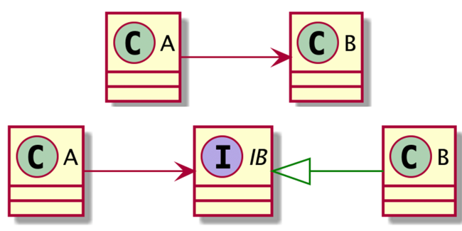

# Clean Architecture

- [The Clean Architecture from The Clean Code Blog](https://blog.cleancoder.com/uncle-bob/2012/08/13/the-clean-architecture.html)
- [The Clean Architecture翻訳](https://blog.tai2.net/the_clean_architecture.html)  

  

`依存性のルール`として、`ソースコードは、内側に向かってのみ依存することができる`


Application Business Rules(UseCases)レイヤー及び、Interface Adapterレイヤーは抽象に依存することで、依存関係逆転の法則(DIP)によって依存性のルールを満たす

## このアーキテクチャーによって実現したいこと
1. フレームワーク独立
2. テスト可能
  - ビジネスルールは、UI、データベース、ウェブサーバー、その他外部の要素なしにテストできる 
3. UI独立
  - UIは、容易に変更できる
4. データベース独立
5. 外部機能独立

## Layer
### Framework & Device (Web, UI, DB, Devices)
- 一般に、このレイヤーには、多くのコードは書かない
### Interface Adapter (Controllers, Presenters, Gateways)
- アダプターの集合
- ユースケースとエンティティにもっとも便利な形式から、データベースやウェブのような外部の機能にもっとも便利な形式に、データを変換する
- たとえば、このレイヤーは、GUIのMVCアーキテクチャを完全に内包する (Blogによると)

### Application Business Rules (Use Cases)
- アプリケーション固有のビジネスルールを含む
- これらのユースケースは、エンティティからの、あるいはエンティティーへのデータの流れを組み立てる。
- そして、エンティティ、プロジェクトレベルのビジネスルールを使って、ユースケースの目的を達成せよと指示する。

### Enterprise Business Rules (Entities)
- エンティティは、メソッドを持ったオブジェクトかもしれない
- あるいは、データ構造と関数の集合かもしれない

## 重要なルール

### 依存性のルール
- 上記の図において、ソースコードは、内側に向かってのみ依存することができる
- 外側の円で宣言されたものの名前を、内側の円から言及してはならない

### 関心の分離
ソフトウェアをレイヤーに分けることによって、関心の分離を達成する

### 依存関係逆転の法則 (Dependency Inversion Principle:DIP)
図でいう、右下の図の「コントローラーからはじまり、ユースケースを抜けて、プレゼンターで実行される」という矛盾を 依存関係逆転の原則(Dependency Inversion Principle) で解決する

  

## Github References

- [Go-Clean-Architecture-REST-API](https://github.com/AleksK1NG/Go-Clean-Architecture-REST-API)

- [Clean Architecture using Golang](https://eminetto.medium.com/clean-architecture-using-golang-b63587aa5e3f)
  - example のディレクトリ構成は整っている
  ```
  pkg/user
  - entity.go ...userモデルの構造体を定義
  - mongodb.go ...DB操作の実装
  - repository.go　...DB操作のinterface
  - service.go ...ビジネスロジックを担うベースとなる構造体を定義
  ```
- [bxcodec/go-clean-arch](https://github.com/bxcodec/go-clean-arch)
  - 多くのレビュアーの意見を取り入れてブラッシュアップされてきた感があるので、良い Model かもしれないが、分割の概念がディレクトリ名として表現されているのが、golang の思想に反する気がする。
- [Trying Clean Architecture on Golang](https://hackernoon.com/golang-clean-archithecture-efd6d7c43047)

## アーキテクチャの変遷

- レイヤードアーキテクチャ
- ヘキサゴナルアーキテクチャ
- オニオンアーキテクチャ
