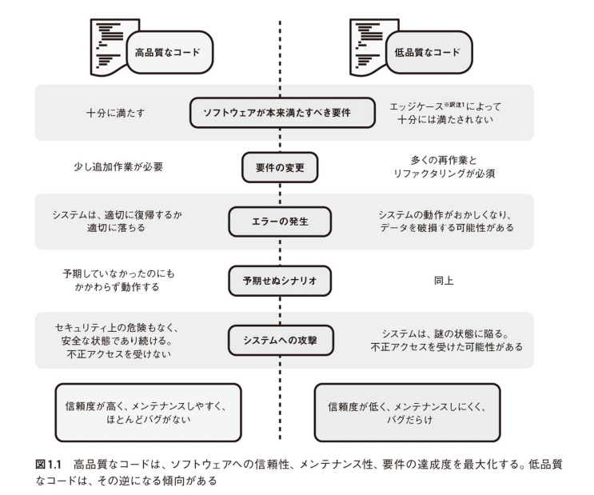

# Good Code, Bad Code 持続可能な開発のためのソフトウェアエンジニア的思想

## Part 1. 理論編

### Chapter 1. コードの品質

- 高品質なコード
  - 信頼度が高く、メンテナンスしやすく、バグが少ない
- 低品質なコード
  - 信頼度が低く、メンテナンスしにくく、バグだらけ

#### 高品質なコードが大事な理由

- `高品質なコードを書くこと`は、最初は開発の速度を落とすように見えるが、多くの場合、`中長期的には開発の速度を上げることに繋がる`

#### 高品質なコードが満たすべき４つのゴール

- `正しく動くこと`
  - 要件を満たし、バグがない、パフォーマンスやセキュリティーについても同様
- `正しく動作し続けること`
  - 長期的に動作し続けること
  - コードは機能追加や仕様変更などによって修正が加えられることになる
  - コードは他のコードに依存しているため、外部の修正によって壊れないことが重要
- `要件の変更に対応しやすいこと`
  - コードを将来の変更に対応しやすくすることが重要
- `車輪の再発明をしないこと`
  - 既存のコードを使うことのメリットは、
    - 時間と労力の節約
    - バグが減る
    - 既存の専門技術を使える
    - コードが理解しやすくなる

#### 高品質なコードであることを担保するための 6 つの上位の戦略

- `可読性`: コードを読みやすくする
- 想定外の事態をなくす
- 誤用しにくいコードを書く
- `モジュール性`: コードをモジュール化する
  - モジュール性とは物やシステムが交換可能なより小さいコンポーネントにまとめられることを指す
  - 機能を管理しやすい単位に分け、その単位間で相互作用する方法を明確に定義し、ドキュメント化する
- `再利用性と汎化`: コードを再利用、汎用化しやすくする
  - `再利用性`とは、特定のあるものが複数のシナリオに出てくる同じ問題の解決に利用できること
  - `汎用性`とは、微妙に異なるものの、概念的には似ている複数の問題の解決に利用できること
  - モジュール化されたコードは、再利用、汎用化しやすくなる傾向がある
- `テスタビリティ`: テストしやすいコードを書き、適切にテストする
  - どれだけ test しやすいか、testability が重要になる
  - コーディングの段階でテストのことを考慮すること

### Chapter 2. 抽象化レイヤー

- どのようにコードを構造化するかは、コード品質における最も基本的な側面となる
- うまく構造化できれば、きれいな抽象化レイヤーにつながる
- 抽象化レイヤーを反映するようにコードを構造化することが、コードの読みやすさ、再利用性、汎用化のしやすさと Testability を大幅に改善する

#### 問題をきれいな抽象化レイヤーで小さな問題に切り分ける

- これにより個々のコードがそれほど複雑に見えることはない
- これによって複雑さを制御する

#### 抽象化レイヤーがいくつかのコード品質の柱を達成するのに、どのように役立つか

- `高品質なコードであることを担保するための 6 つの上位の戦略`のうち、`4 つを達成する`ことができる
  - 読みやすさ
  - モジュール性
  - 再利用性と汎用化
  - Testability

#### コードのレイヤー、API と実装の詳細

- コードを書くときに考えるべき 2 つの側面
  - 私達のコードの呼び出し元からみえるもの
  - 私達のコードを使う呼び出し元からはみえないもの。実装の詳細
- プログラミング言語のコードをさまざまな単位に分割するための構成概念
  - 関数
  - クラス
  - インターフェイス
  - パッケージ、名前空間、モジュール

##### 関数

- 単一のタスクのみを扱う
- 関数を小さくして焦点を絞ることは、コードの読みやすさと再利用性を担保する方法の１つ

##### クラス

- 行数。300 行を超えないようにする。多くの概念を含みすぎている場合は分割する。
- `凝縮`
  - 凝縮とは、クラス内のモノがどれだけ適切なクラスに所属しているかを評価するもので、凝集度の高いクラスがよいとされている
  - どれが何に凝集しているかを分類する方法は以下の通り
    - 逐次的凝集
      - 1 つの出力が他の入力に必要な場合、逐次的凝集が発生する
    - 機能的凝集
      - 一連のモノがすべて 1 つのタスクのために動く場合、機能的凝集が発生する
- `関心の分離`
  - `システムが個別に対処している問題ごとに、独立したコンポーネントとして分離すべき`という考え方の設計原則
- 凝集と関心の分離の考え方においては、関連するものをどのように１つにまとめれば役に立つかの基準を決定することが必要
- [重要] コードのレイヤー、クラスの作成に関する`コード品質の 4 つの柱`
  - `可読性`: コードを読みやすくする
    - 1 つのクラスにさまざまな概念を取り込むほど、コードは読みづらくなる
  - `モジュール性`: コードをモジュール化する
    - クラスやインターフェイスを使うことは、コードをモジュール化するための良い方法
    - 必要に応じて異なる実装と交換することも可能
  - `再利用性と汎化`: コードの再利用性を高め、汎用化しやすくする
  - `テスタビリティ`: テストしやすいコードを書き、適切にテストする
- 凝集性の捉え方は主観により異なり、意見が分かれるケースもある。クラスをどのように分割すべきかを適切に判断するために`コード品質の柱`と照らし合わせる
  - e.g. コードが読みやすくない
  - e.g. コードがそれほどモジュール化されていない
  - e.g. コードの再利用性が低い
- コードを改善する方法
  - それぞれの小さな問題への解決策を別のクラスに分割する

##### インターフェイス

#### 関数、クラス、インターフェイスを使って、コードを明確な抽象化レイヤーに分割する方法

- API
  - きれいに抽象化レイヤーを作れる
  - 入力と出力が明確になっている
- 関数
  - 単一のことをやらせるのに適してる
  - 組み合わせて複雑な振る舞いを構成できる
  - 小さくして焦点を絞ることが重要
- クラス

  - 行数である程度、凝縮状態を判別できる
    - 関心事の分離
    - 凝縮度合い

- 適切なクラスの大きさに分割することは、よい抽象化レイヤーを担保することになり、時間を使うだけの価値はある
- レイヤーが厚すぎるのは、レイヤーが薄すぎる問題よりも悪化するケースが多い
- レイヤーの分離範囲に迷うのであれば、薄い方に寄せた方が無難

### Chapter 3. コードへの契約

- コード書くときの注意点
  - 明確だと思っても、他の人には明確ではない
  - 他のエンジニアの不注意でコードが壊れる
  - 書いたコードのことは忘れることを考慮に入れる
- 上記の対策

  - 名前
  - データの型
    - コンパイルで使い方の理解を促せる
    - 強く使い方を矯正でき、誤用を避けさせる
  - ドキュメントやコメント
    - 読まれるとは限らない
    - メンテされてない可能性もある
    - 理解させるための補助くらいに考える
  - コードを読ませる
    - 長いコードは読めないので、やめる

- ルールを守らせるなら、コンパイルエラーが一番強制力が強い
- それが不可能である場合、チェック処理やアサーションを利用した契約の強制が代替案となる

### Chapter 4. エラー

- エラーは隠蔽しないほうがいい。
- 早く失敗し、通知をしたほうが被害を抑えられる。
- エラーの種類
  - システム回復可
  - システム回復不可

## Part 2. 実践編

### Chapter 5. コードを読みやすくする

- わかり安い名前を使う
  - 名前はコードの見え方に多大な影響を与える
  - コメントは、分かりやすい命名の不適切な代替案
- コメントは、なぜに焦点を当てる。コードだけですべて表現するのには限界がある
  - コードの存在理由を書く
- 冗長なコメントは避ける
  - メンテナンスコストがかかる
  - コードを乱雑にする可能性がある
  - 必ずしも読みやすいコードの代価にはならない
- コメントには、トップレベルの要約を書く
- 簡潔だけど理解できないコードは避ける
  - 演算子を多用してたり、ビットのマスクを使っているのは、完結でも読みにくい
  - 誤用を引き起こしやすい
  - コード量を減らすためにやっているのだとしたら、やめる
- 一貫性のないコーディング
  - 混乱を招く可能性大
- ネストの深いコードは避ける
  - ロジックを追うのが困難になる
  - ネストが多いのは、関心事が多すぎる結果である可能性が高い
- 関数の呼び出しを読みやすくする
  - 名前付き引数を利用する
  - 説明的な型を使用する
- 説明のない値の利用を避ける
  - 誤用し易い
  - 適切な名前の定数に置き換える
- 無名関数を適切に使用する
  - 大きな処理や自明でない処理を無名関数として使用するのは避ける
  - 小さな処理に適用する
- 新しい言語機能を適切に使用する
  - 既存の問題が、新機能によって解決できることもある
  - 必ずしも最善とは限らないので、用途の見極めを慎重にする

### Chapter 6. 想定外の事態をなくす

- マジックバリュー(ハードコードされた値)の戻り値をなくす
  - 誤用される可能性大
  - 異常値であることが判別されないことがある
  - null やオプショナル、エラー等で代価できないか考える
- nul オブジェクトを適切に使用する
  - 空のコレクションで解決できることもある
  - 想定外の事態を起こす可能性もある
- 入力パラメータの変更に注意する
  - 入力パラメータの変更は、バグを発生させる可能性大
- 将来性も加味した列挙型の処理
  - 想定外の値が来たときのケースも考慮する（値が追加になったけど、ロジック入れ忘れ防止のため）

### Chapter 7. 誤用しにくいコードを書く

- 不変にすることを検討する
  - 可変なコードは推測しにくい
  - 可変なコードは、マルチスレッドで問題を起こしやすい
  - 生成時のみ値を設定する
  - 普遍性を実現するデザインパターンを適用する
- 汎用的なデータ型を避ける
  - 誤用し易い
  - 制限がゆるすぎる
  - 専用の型を用意するなどで回避する
- 時間の扱い
  - 単位を揃えないと計算が間違ったりする
  - タイムゾーンの考慮をする
  - 統一したデータ構造を使うようにする

### Chapter 8. コードをモジュール化する

- モジュール化するとテストしやすくなる傾向がある
- DI の使用を検討する
  - ハードコーディングした依存関係は問題になる可能性が高い
  - DI することでモックによるテストが容易になる
- インタフェースに依存する
  - 抽象化レイヤーを維持しやすい
  - 高いモジュール性を維持できる
- クラスの継承に注意
  - 想定外の継承は、抽象化レイヤーを壊す
  - コンポジションを利用して抽象化レイヤーの破壊を防止する
- クラスは自分自身に関心を持つべき
  - 一つの変更が他クラスへ影響が発生しないようにする
- 関連データをまとめてカプセル化する
  - 関連データはクラスにグループ化する
- 戻り値から実装の詳細が漏れることに注意する
  - 内部の実装が漏れていると、内部の処理の変更の影響が、多くの場所に発生してしまう
  - レイヤーに適した戻り値を返すようにする
- 例外から実装の詳細が漏洩することにも注意する
  - 非検査か検査例外を発生させるのかは、十分に検討する

### Chapter 9. コードを再利用、汎用化しやすくする

- 再利用を促すことで、労力を節約できる
- グローバルな変数の利用は避ける
  - 管理コストが想定より高い
  - 再利用すると危険になる
- 抽象化レイヤーを作ることを心がける
  - 再利用が促進される

## Part 3. UnitTest 編

### Chapter 10. UnitTest の原則

### Chapter 11. UnitTest の実践

## その他

### null 安全 (void 安全)

- `null`は値を取得できない場合などに、使われる
- 変数や関数の返す値が`null`である可能性を示し最初にその値を null か否かをチェックしなければ、利用できないようにコンパイラーが強制するというもの
- null 安全をサポートしていない言語を使う場合は、代替えとして`optional型`を利用する

## 書評 references

- [【書評】Good Code, Bad Code ～持続可能な開発のためのソフトウェアエンジニア的思考](https://suzaku-tec.hatenadiary.jp/entry/2023/05/28/084011)
