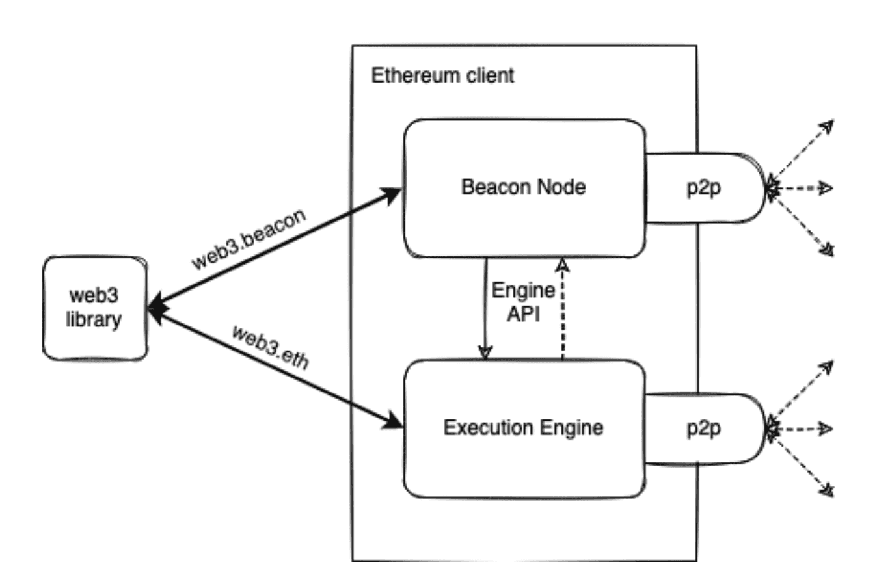
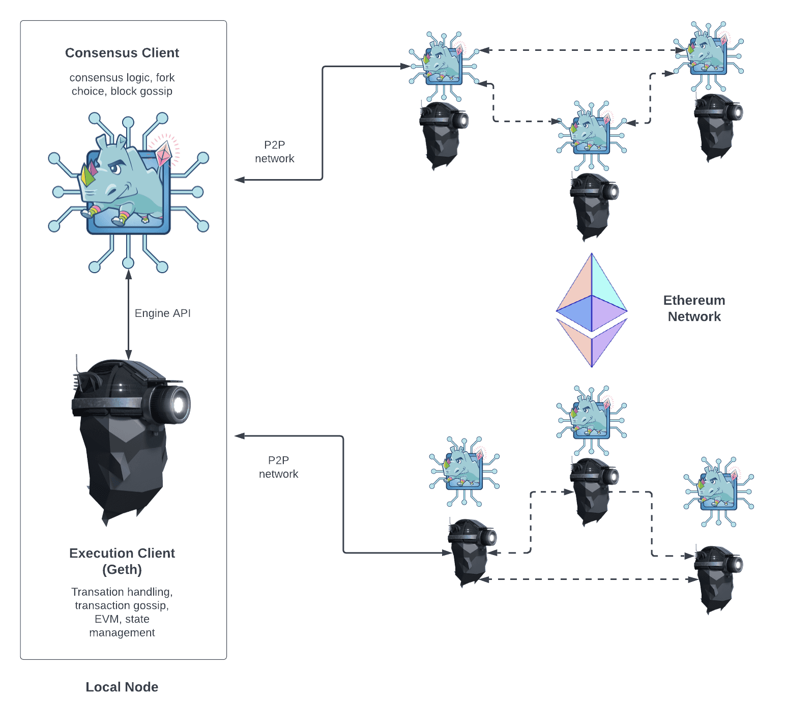

# Nodeとクライアント

- [Docs](https://ethereum.org/en/developers/docs/nodes-and-clients/)
- [execution-specs](https://github.com/ethereum/execution-specs/)
- [consensus-specs](https://github.com/ethereum/consensus-specs)

- Ethereumは、ブロックとトランザクションデータを検証できるソフトウェアを実行するコンピュータ（Nodeと呼ばれる）の分散型ネットワーク
- `クライアント`と呼ばれるソフトウェア・アプリケーションをコンピュータ上で実行し、Ethereumの`Node`にする必要がある
- 実行クライアントを単独で実行することはできなくなったため、The Mergeの後、ユーザーがイーサリアムネットワークにアクセスするためには、`実行クライアント`と`コンセンサスクライアント`の両方を一緒に実行する必要がある
- `Node`とは、Ethereumのクライアントソフトウェアのインスタンスで、同じくイーサリアムのソフトウェアを実行している他のコンピュータに接続され、ネットワークを形成しているもの
- `クライアント`は、データをプロトコルの規則に照らして検証し、ネットワークを安全に保つ、イーサリアムの実装
- Post-Merge Ethereum は、実行層と合意層の2つの部分から構成されるが、両レイヤーは、それぞれ異なるクライアントソフトウェアによって実行される
- `実行クライアント`（実行エンジン、ELクライアント(execution layer)、または旧Eth1クライアントとも呼ばれる）は、ネットワークでブロードキャストされた新しいトランザクションを聞き、EVMで実行し、最新の状態と現在のすべてのEthereumデータのデータベースを保持します。 
- `コンセンサスクライアント`（ビーコンNode、CLクライアント(consensus layer)、旧Eth2クライアントとも呼ばれる）は、Proof-of-stakeコンセンサスアルゴリズムを実装し、実行クライアントからの検証済みデータに基づいてネットワークの合意を達成することができる

## ネットワーク上のNodeを追跡する
- [Ethereum Node Tracker](https://etherscan.io/nodetracker)
- [Ethereum Mainnet Statistics](https://ethernodes.org/)
- [Eth2 Nodewatch: General Information](https://www.nodewatch.io/)

## Nodeの種類

### Full node
- ブロックチェーンの全データを保存（ただし、これは定期的に刈り取られるため、フルNodeは創世記までの全状態データを保存しない） 
- ブロックバリデーションに参加し、すべてのブロックとステートを検証する。 
- すべての状態はフルNodeから導き出すことができる（ただし、非常に古い状態はアーカイブNodeへのリクエストから再構築される）
- ネットワークにサービスを提供し、要求に応じてデータを提供する

### Light node
- すべてのブロックをダウンロードするのではなく、ブロックヘッダをダウンロードする
- これらのヘッダには、ブロックの内容に関する概要情報のみが含まれている
- Light nodeが必要とするその他の情報は、Full nodeに要求する
- Light nodeは、受信したデータをブロックヘッダ内のステートルートに照らして独自に検証することができる
- Light nodeにより、ユーザーはFull nodeの実行に必要な強力なハードウェアや広帯域幅を使わずにEthereumネットワークに参加することができる
- 最終的には、Light nodeは携帯電話や組み込みデバイスで動作するようになるかもしれない
- Light nodeはコンセンサスに参加しないが（つまり、マイナー／Validatorにはなれません）、Full nodeと同じ機能とセキュリティ保証でEthereumのブロックチェーンにアクセスすることが可能

- 実行クライアントである`Geth`には、[light sync](https://github.com/ethereum/devp2p/blob/master/caps/les.md)オプションがある
- しかし、ライトなGethのNodeは、ライトなNodeのデータを提供するフルNodeに依存する
- Light nodeのデータを提供することを選ぶFull nodeはほとんどなく、Light nodeはしばしばピアを見つけることができないことを意味する

- `Light clients`はEthereumの活発な開発分野であり、コンセンサス層と実行層の新しい`Light clients`が間もなく登場すると思われる (2022/12/30現在)
- ゴシップネットワーク上でLight clientデータを提供するルートも考えられる
- ゴシップネットワークは、Full nodeがリクエストに応えることを必要とせずにLight nodeのネットワークをサポートすることができるため、これは有利なこと

- Ethereumはまだ多くのLight nodeをサポートしていないが、Light nodeのサポートは近い将来、急速に発展すると予想される分野
- 特に、`Nimbus`、`Helios`、`LodeStar`などのクライアントは、現在Light nodeに大きく注力している

### Archive node

- Full nodeに保持されているすべてのものを保存し、過去の状態のアーカイブを構築する
- ブロック#4,000,000の口座残高のようなものを照会したい場合や、トレースを使ってマイニングすることなく、単純かつ確実に自分のトランザクションセットをテストしたい場合に必要となる
- このデータはテラバイトの単位を表すため、一般ユーザーにとってアーカイブNodeは魅力的ではないが、`ブロックエクスプローラ`、ウォレットベンダー、チェーン分析などのサービスには便利
- アーカイブ以外のモードでクライアントを同期すると、ブロックチェーンデータが刈り取られることになる
- つまり、すべての履歴状態のアーカイブは存在しませんが、フルNodeはオンデマンドで構築することができる

## 自分でNodeを立てるメリット
- 全てのトランザクションとブロックを自分自身で検証できる
- Ethereumからのデータに依存する他のサービスを実行し、セルフホスティングすることができる。
  - 例えば、ビーコンチェーンValidator、レイヤー2などのソフトウェア、インフラ、ブロックエクスプローラ、ペイメントプロセッサーなど
- カスタムRPCエンドポイントを提供することができる
- プロセス間通信（IPC）を使ってNodeに接続したり、プラグインとしてプログラムを読み込むようにNodeをカスタマイズすることができる
- ETHを直接ステークしてネットワークを確保し、報酬を獲得することができる

## 実行クライアント
- Go Ethereum (Geth)
- Nethermind
- Besu
- Erigon
- Akula
- OpenEthereum (deprecated)

## コンセンサスクライアント
- Prysm
- Lighthouse
- Lodestar
- Nimbus
- Teku

## 同期モード
これはトレードオフの関係にある

### 実行レイヤー同期モード
- Full sync
  - すべてのブロック（ヘッダー、トランザクション、レシートを含む）をダウンロードし、Genesisからすべてのブロックを実行することによって、ブロックチェーンの状態を定期的にに生成する
  - すべてのトランザクションを検証することにより、信頼を最小化し、最高のセキュリティを提供する
  - トランザクション件数が増加すると、すべてのトランザクションを処理するのに数日から数週間かかることもある
- Fast sync
  - すべてのブロック（ヘッダー、トランザクション、レシートを含む）をダウンロードし、すべてのヘッダーを検証し、状態をダウンロードし、ヘッダーと照合して検証する
  - コンセンサスメカニズムの安全性に依存する
  - 同期には数時間しかかからない
- Light sync
  - Light Clientモードでは、すべてのブロックヘッダ、ブロックデータをダウンロードし、いくつかのランダムな検証を行う
  - 信頼できるチェックポイントからチェーンの先端部分のみを同期させる
  - 開発者の信頼とコンセンサスメカニズムに依存しながら、最新の状態のみを取得する
  - 数分後には現在のネットワークの状態でクライアントが使用できるようになる
  - 注意点として、`Light sync`はまだProof-of-stake Ethereumに対応していない
- Snap sync
  - Gethチームによって開拓された、クライアントを同期するための最新のアプローチ
  - Peerによって提供される動的スナップショットを使用すると、中間トライNodeをダウンロードせずにすべてのアカウントとストレージデータを取得し、ローカルでMerkleトライを再構築することができる
  - 現在Ethereumのmainnetで`デフォルト`となっている最速の同期戦略
  - セキュリティを犠牲にすることなく、ディスク使用量とネットワーク帯域幅を大幅に節約できる 
- [Optimistic sync](https://github.com/ethereum/consensus-specs/blob/dev/sync/optimistic.md)
  - オプトインと後方互換性を持つように設計されたマージ後の同期戦略
  - 実行Nodeが確立した方法によって同期することを可能にする
  - 実行エンジンはビーコンブロックを完全に検証することなく最適にインポートし、最新のヘッドを見つけ、上記の方法でチェーンの同期を開始することができる
  - そして、実行クライアントが追いついた後、ビーコンチェーンのトランザクションの有効性をコンセンサス・クライアントに通知する

### コンセンサスレイヤー同期モード ??
- Checkpoint sync
  - 弱主体性シンクとも呼ばれ、Beacon Nodeのシンクに優れたユーザーエクスペリエンスを生み出す
  - これは弱い主観性の仮定に基づいており、genesisの代わりに最近の弱い主観性のチェックポイントからBeacon Chainを同期することを可能にする
  - チェックポイント同期により、genesis からの同期と同様の信頼性仮定で、最初の同期時間が大幅に短縮される

## Nodeアーキテクチャー

- この2つのクライアント構造が機能するためには、コンセンサスクライアントがトランザクションのバンドルを実行クライアントに渡すことができなければならない
- ローカルでトランザクションを実行することで、クライアントはトランザクションがEthereumの規則に違反していないこと、そしてEthereumの状態への更新が正しいことを検証する
- 同様に、Nodeがブロック生産者に選ばれたとき、コンセンサスクライアントは新しいブロックに含めるトランザクションのバンドルをGethに要求し、それらを実行してグローバルな状態を更新できるようにしなければならない。
- このクライアント間の通信は、`エンジンAPI`を使用したローカルRPC接続によって処理される

### 実行クライアントの役割
- 担当すること
  - トランザクション処理、
  - トランザクションゴシップ、
  - ステート管理、
  - Ethereum Virtual Machine（EVM）のサポート
  - トランザクションのリスト、更新された状態トライ、およびその他の実行関連データである実行ペイロードを作成する
    - これらはコンセンサス・クライアントによって、各ブロックに実行ペイロードを含める
  - 新しいブロックのトランザクションを再実行し、それらが有効であることを確認する
  - トランザクションの実行は、Ethereum Virtual Machine（EVM）と呼ばれる実行クライアントの組み込みコンピュータで行われる
  - RPCメソッドを通じてEthereumへのUIも提供し、ユーザーはEthereumのブロックチェーンへの問い合わせ、トランザクションの提出、スマートコントラクトのデプロイができるようになる

- 担当しないこと (コンセンサスクライアントの権限)
  - ブロック構築、
  - ブロックゴシップ
  - コンセンサスロジックの処理
- まとめ
  - Ethereumへのユーザーゲートウェイ
  - Ethereum Virtual Machine(EVM)、Ethereumのステートおよびトランザクションプールを持つ

### コンセンサスクライアントの役割
- NodeがEthereumネットワークと同期するためのすべてのロジックを処理する
- これには、peerからブロックを受け取り、フォーク選択アルゴリズムを実行して、Nodeが常に（Validatorの有効残高で重み付けされた）attestations(認証)の最大蓄積を持つチェーンに従うことを保証することが含まれる
- 実行クライアントと同様に、コンセンサスクライアントも独自の P2P ネットワークを持ち、ブロックとattestations(認証)を共有する

- コンセンサスクライアントはブロックの認証や提案に関与しない。これは、コンセンサスクライアントにオプションで追加できる`Validator`によって行われる
- Validatorを持たないコンセンサスクライアントは、`チェーンの先頭にあるNodeを同期させるだけ`となる
- これにより、ユーザーは実行クライアントを使用して、自分が正しいチェーン上にいることを確信しながらEthereumとトランザクションすることができる

### Validator
- `32ETH`が`deposit contract`にある場合、Nodeオペレータはコンセンサスクライアントに`Validator`を追加することができる
- Validatorクライアントはコンセンサスクライアントに同梱されており、いつでもNodeに追加することができる
- Validatorは`attestations(認証)`と`block proposals`を処理する
- これらにより、Nodeは報酬を得たり、ペナルティやslashingによりETHを失ったりすることができる
- Validatorを実行することで、Nodeは新しいブロックを提案するために選ばれる資格を得ることもできる

[Staking](https://ethereum.org/en/staking/)

### Node比較の構成要素
- 実行クライアント
  - P2Pネットワーク上でトランザクションをゴシップする
  - トランザクションの実行・再実行
  - 受信した状態変化を確認する
  - ステートトライとレシートトライを管理する
  - 実行ペイロードの作成
  - Ethereumと対話するためのJSON-RPC APIを公開する
- コンセンサスクライアント
  - P2Pネットワーク上でブロックと認証をゴシップする
  - フォーク選択アルゴリズムの実行
  - チェーンの先頭を把握する
  - Beaconの状態を管理する（コンセンサスと実行情報を含む）
  - RANDAOで蓄積されたランダム性を記録する
  - 正当性とファイナライズの記録を保持する
- Validator
  - ブロックの提案
  - 報酬・ペナルティの発生
  - attestations(証明書)の作成
  - 32ETHのstakingが必要
  - ブロックの提案
  - Slashされる
