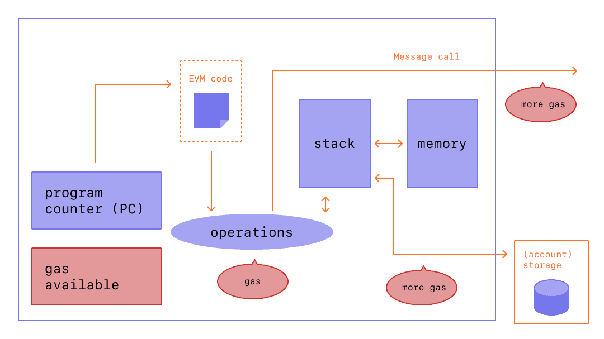

# Ethereum Transaction And Gas

## [Transaction](https://ethereum.org/en/developers/docs/transactions/)

### Transactionとは
- Ethereumのトランザクションは、外部所有のアカウントが管理するアカウントによって開始されるアクションを指す
- この状態を変えるアクションは、トランザクションの中で行われる。これにより `world state`が変化する
- EVMの状態を変更するトランザクションは、ネットワーク全体にブロードキャストされる必要がある
- どのノードもEVM上でトランザクションを実行するよう要求をブロードキャストすることができる
- この後、バリデータがトランザクションを実行し、その結果の状態変化をネットワークの残りの部分に伝達する
- トランザクションにはfeeが必要で、検証済みのブロックに含まれる必要がある

### 送信されたトランザクションに含まれるもの
- recipient
  - 受け取りアドレス
    - 外部所有アカウントの場合、トランザクションはvalueを転送する
    - コントラクトアカウントの場合、トランザクションはContractコードを実行する
- signature:署名
  - 送信者の識別子
  - これは送信者の秘密鍵がトランザクションに署名し、送信者がこのトランザクションを許可したことを確認するときに生成される 
- nonce
  - アカウントからのトランザクション番号を示す連続的に増加するカウンタ
- value
  - 送信者から受信者に転送するETHの量（WEI: ETHのdenomination 単位名）
- data
  - 任意のデータを格納するためのオプションフィールド． 
- gasLimit
  - トランザクションで消費されるガス単位の最大量。ガスの単位は計算のステップを表す 
- maxPriorityFeePerGas
  - バリデータへのチップとして含まれるガスの最大量 
- maxFeePerGas
  - トランザクションのために支払われるガスの最大量（baseFeePerGasとmaxPriorityFeePerGas を含む）


[Gas](https://ethereum.org/en/developers/docs/gas/)は、バリデータでトランザクションを処理するために必要な計算への参照であり、ユーザーはこの計算のために料金を支払わなければならない。`gasLimit` および`maxPriorityFeePerGas`は、バリデータに支払うトランザクション手数料の上限を決定する。

### トランザクションオブジェクト
- トランザクションオブジェクト例
```
{
  from: "0xEA674fdDe714fd979de3EdF0F56AA9716B898ec8",
  to: "0xac03bb73b6a9e108530aff4df5077c2b3d481e5a",
  gasLimit: "21000",
  maxFeePerGas: "300",
  maxPriorityFeePerGas: "10",
  nonce: "0",
  value: "10000000000"
}
```

トランザクションオブジェクトは送信者の秘密鍵を使用して署名する必要がある。これは、そのトランザクションが送信者からのものでしかなく、不正に送信されたものではないことを証明するもの。
GethのようなEthereumクライアントがこの署名プロセスを処理することになる。

- JSON-RPCによる`account_signTransaction` callの例
```
// Request
{
  "id": 2,
  "jsonrpc": "2.0",
  "method": "account_signTransaction",
  "params": [
    {
      "from": "0x1923f626bb8dc025849e00f99c25fe2b2f7fb0db",
      "gas": "0x55555",
      "maxFeePerGas": "0x1234",
      "maxPriorityFeePerGas": "0x1234",
      "input": "0xabcd",
      "nonce": "0x0",
      "to": "0x07a565b7ed7d7a678680a4c162885bedbb695fe0",
      "value": "0x1234"
    }
  ]
}

// Response
{
  "jsonrpc": "2.0",
  "id": 2,
  "result": {
    "raw": "0xf88380018203339407a565b7ed7d7a678680a4c162885bedbb695fe080a44401a6e4000000000000000000000000000000000000000000000000000000000000001226a0223a7c9bcf5531c99be5ea7082183816eb20cfe0bbc322e97cc5c7f71ab8b20ea02aadee6b34b45bb15bc42d9c09de4a6754e7000908da72d48cc7704971491663",
    "tx": {
      "nonce": "0x0",
      "maxFeePerGas": "0x1234",
      "maxPriorityFeePerGas": "0x1234",
      "gas": "0x55555",
      "to": "0x07a565b7ed7d7a678680a4c162885bedbb695fe0",
      "value": "0x1234",
      "input": "0xabcd",
      "v": "0x26",
      "r": "0x223a7c9bcf5531c99be5ea7082183816eb20cfe0bbc322e97cc5c7f71ab8b20e",
      "s": "0x2aadee6b34b45bb15bc42d9c09de4a6754e7000908da72d48cc7704971491663",
      "hash": "0xeba2df809e7a612a0a0d444ccfa5c839624bdc00dd29e3340d46df3870f8a30e"
    }
  }
}
```

- `raw`は再帰的長さプレフィックス(RLP)で符号化された署名済みトランザクション
- `tx`はJSON形式の署名済みトランザクション
- 署名ハッシュにより、そのトランザクションが送信者から送られ、ネットワークに提出されたことを暗号的に証明することができる

### トランザクションのデータフィールド: data filed
- ほとんどのトランザクションは、外部所有のアカウントからコントラクトにアクセスする
- コントラクトのほとんどは Solidity で書かれており、`アプリケーションバイナリインターフェース (ABI)` に従ってそのデータフィールドを解釈する
- 最初の4バイトは、関数名と引数のハッシュを使用して、どの関数を呼び出すかを指定する
- このデータベースを使用して、セレクタから関数を特定できる場合もある
- calldataの残りは引数で、ABI仕様で指定されたとおりにエンコードされている
-  例えば、[このトランザクション](https://etherscan.io/tx/0xd0dcbe007569fcfa1902dae0ab8b4e078efe42e231786312289b1eee5590f6a1)の場合
  -  `Calldata`を見るには、`Click to see More` をクリックして、更なる詳細を表示する
  -  `関数セレクタ`は0xa9059cbbだが、このシグネチャを持つ既知の関数がいくつかある。 この場合、コントラクトのソースコードがEtherscanにアップロードされているので、関数はtransfer(address,uint256)であることがわかっている
  - 残りのデータ
```
0000000000000000000000004f6742badb049791cd9a37ea913f2bac38d01279
000000000000000000000000000000000000000000000000000000003b0559f4
```
    - ABIの仕様によると、整数値（アドレスなど、20バイトの整数）は、`32バイト`のワードとして現れ、前面にゼロがパディングされる
    - つまり、`to`アドレス は`4f6742badb049791cd9a37ea913f2bac38d01279`とわかる
    - その値は0x3b0559f4=990206452である。

### トランザクションのType
- Regular transactions
  - ある口座から別の口座へのトランザクション
- Contract deployment transactions
  - データフィールドが契約コードに使用される、「宛先」アドレスのないトランザクション
- Execution of a contract
  - デプロイされたスマートコントラクトと相互作用するトランザクション。この場合、`to` アドレスはスマートコントラクトのアドレスとなる

### On Gas
- 前述のとおり、トランザクションの実行にはガスが必要
- 単純なTransferトランザクションには`21000`ユニットのガスが必要
- つまり、ボブがアリスに`1ETH`を`baseFeePerGas:190gwei`、`maxPriorityFeePerGas:10gwei`で送るには、ボブは以下の手数料を自分のアカウントから支払う必要がある。
```
// (baseFeePerGas + maxPriorityFeePerGas) * GasLimit
(190 + 10) * 21000 = 4,200,000 gwei (0.0042 ETH)
// 0.0042というfeeの内訳は以下の通り
// base fee:        0.00399 ETH
// Validator's tip: 0.000210 ETH
```


### トランザクションのライフサイクル
- トランザクションが送信されると、次のようになる
  - トランザクションを送信すると、暗号化によりトランザクションハッシュが生成される`0x97d99bc7729211111a21b12c933c949d4f31684f1d6954ff477d0477538ff017` 
  - そして、そのトランザクションはネットワークにブロードキャストされ、他の多くのトランザクションと一緒にプールに含まれる
  - バリデータは、トランザクションを検証して `successful` と見なすために、あなたのトランザクションを選んでブロックに含めなければならない
  - 時間が経つにつれて、あなたのトランザクションを含むブロックは`justified`,`finalized`にアップグレードされる。これらのアップグレードにより、あなたのトランザクションが成功し、決して変更されないことがより確実となる。いったん`finalized`されたブロックは、何十億ドルもかかる攻撃によってのみ変更することができる。

### TYPED TRANSACTION ENVELOPE
- Ethereumはもともと、トランザクションのフォーマットが1つだった
- 各トランザクションには、`nonce, gas price, gas limit, to address, value, data, v, r, s` が含まれており、これらのフィールドは`RLPエンコード`され、以下のような形になっている
```
RLP([nonce、gasPrice、gasLimit、to、value、data、v、r、s])
```
- Ethereumは、アクセスリストや[EIP-1559](https://github.com/ethereum/EIPs/blob/master/EIPS/eip-1559.md) などの新機能をレガシーなトランザクション形式に影響を与えずに実装できるよう、複数の種類のトランザクションをサポートするように進化してきた。
  - EIP-1559: Fee market change for ETH 1.0 chain 
- [EIP-2718: Typed Transaction Envelope](https://eips.ethereum.org/EIPS/eip-2718)は、将来のトランザクションタイプのエンベロープとなるトランザクションタイプを定義している
  - `EIP-2718`は、型付けされたトランザクションのための新しい一般化されたエンベロープである
  - 新しい規格では、トランザクションは次のように解釈される
```
TransactionType || TransactionPayload
// TransactionType: 0から0x7fまでの数字で、合計128のトランザクションタイプが可能
// TransactionPayload: トランザクションの種類によって定義される任意のバイト配列
```

## [Gas and Fee](https://ethereum.org/en/developers/docs/gas/)
Gasとは、Ethereumネットワーク上で特定の操作を実行するために必要な計算量を測定する単位を指す  
Ethereumのトランザクションは実行するために計算リソースを必要とするため、トランザクションごとに手数料が必要となる  
Gasとは、Ethereum上でトランザクションを正常に行うために必要なfeeのことを指す  



- `Gas fees`は、Ethereumのネイティブ通貨である`ether（ETH）`で支払われる
- `Gas prices`は`gwei`で表記される
  - gweiはETHの1通貨であり、1gweiは0.000000001ETHと等しい

### 2021/8に発生したLondonアップグレード以前
例えば、アリスがボブに1ETHを支払う場合、このトランザクションでは、`gas limit`は`21,000`で、`gas price`は200gweiとなる  
このとき、手数料の合計は、
```
Gas units (limit) * Gas price per unit
=> 21,000 * 200 = 4,200,000 gwei (0.0042 ETH)
```

### 2021/8に発生したLondonアップグレード以後
Ethereumネットワークのトランザクションfeeの計算方法が変更された  

例えば、JordanがTaylorに1ETHを支払う場合、このトランザクションでは、`gas limit`は`21,000`で、`base fee`は10gweiとなり、Jordanはこれに、2gweiのチップを含んでいる  
このとき、手数料の合計は、
```
// base fee: protocolによって設定されるvalue
// priority fee: ユーザーによって設定されるvalueで、validatorへのtipとなる
units of gas used * (base fee + priority fee)
=> 21,000 * (10 + 2) = 252,000 gwei (0.000252 ETH)
// fee (0.000252 ETH) の内訳
// Base fee: 0.00021 ETH
// Validator tips: 0.000042 ETH 
```

さらに、Jordan は、トランザクションのmax fee(maxFeePerGas) を設定することもできる。max feeと実際のfeeの差は、Jordanに返金される

### Block size
- Londonアップグレード以前では、Ethereumには固定サイズのブロックがあった。  
- ネットワーク需要が高い時、これらのブロックは全容量で動作していました。その結果、ユーザーはブロックに含まれるために、高い需要が減るのを待たなければならないことが多く、ユーザーエクスペリエンスが低下していた。  
- Londonアップグレードでは、Ethereumに可変サイズブロックが導入された。  
- 各ブロックの目標サイズは`1500万 gas`であるが、ブロックの限界である`3000万 gas`（目標ブロックサイズの2倍）までは、ネットワークの需要に応じてブロックのサイズが増減される。
- このプロトコルでは、`tâtonnement`というプロセスを通じて、平均して`1,500万`という平衡ブロックサイズを実現している。
- つまり、ブロックサイズが目標ブロックサイズより大きい場合、プロトコルは次のブロックの`base fee`を増加させる。
- 同様に、ブロックサイズがターゲットブロックサイズより小さい場合、プロトコルは`base fee`を減少させる。
- `base fee`の調整量は、現在のブロックサイズが目標ブロックサイズからどれだけ離れているかに比例する。
- ブロックの詳細は[こちら](https://ethereum.org/en/developers/docs/blocks/)

### Base fee


### Priority fee (tips)


### Max fee


### Calculating fees


### EIP-1559


### WHY DO GAS FEES EXIST?


### WHAT IS GAS LIMIT?


### WHY CAN GAS FEES GET SO HIGH?


### INITIATIVES TO REDUCE GAS COSTS


### STRATEGIES FOR YOU TO REDUCE GAS COSTS