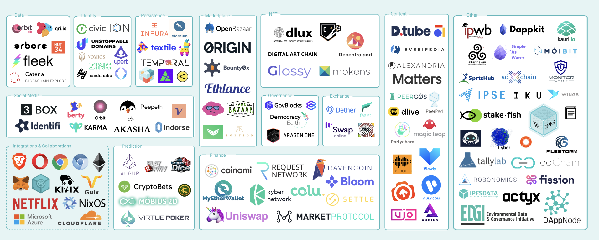

# IPFS Part2

- IPFSは`Inter Planetary File System`の頭文字を取っており、全てのコンピュータデバイスを同じファイルシステムにつなぐことを目的とした分散型ファイルシステム
- ネットワークの各参加者（Peer）がデータを保持し、参加者同士がデータの提供や要求を行う分散型のネットワークモデルであるP2P（Peer to Peer）形式でIPFSのネットワークが形成される
- 耐障害性が高い

## コンテンツ指向型のプロトコル

コンテンツの内容自体を指定して直接アクセスする仕組み

## 分散型ネットワーク

ネットワーク参加者間でデータを偏りなく分散させ管理するアルゴリズムである`DHT（Distributed Hash Table）`を利用している  
これにより、IPFSのネットワーク参加者同士で分散してコンテンツを管理する  
そして、アクセスしたいコンテンツがある場合はそのコンテンツを持っているネットワーク参加者から直接コンテンツを受け取ることができる

## IPFSのメリット

- 対改ざん性
  - コンテンツが少しでも変化するとハッシュ値は変化する
  - もしコンテンツが改ざんされたとしたらコンテンツのハッシュ値も変わるためコンテンツが正しいものであるかを簡単に検証できる
- 耐障害性
  - ある特定のサーバーにデータをアクセスすることなく、ネットワークの参加者同士でデータのやりとりを行う
  - そのため、特定の場所にアクセスが集中してネットワークが遅くなったり、サーバーがダウンしてネットに繋がらなくなったりすることを防ぐことができる

- 耐検閲性
  - コンテンツ指向型プロトコルではドメインやIPアドレスでコンテンツの出どころをブロックし、容易にネット検閲が可能であった
  - IPFSではコンテンツを複数のネットワークの参加者が持っているため、どこか特定の参加者へのアクセスが遮断されても、他の参加者にアクセスしてデータを取得できるため、政府によるネット検閲がかなり難しい仕組みになっている

## IPFSの仕組み

- IPFSにファイルを追加すると、次のようなことが起こる。
  - IPFSにファイルを追加すると、ファイルは小さなチャンクに分割され、暗号的にハッシュ化され、コンテンツ識別子（CID）と呼ばれる一意のフィンガープリントが与えられる。このCIDは、その時点に存在するファイルの永久的な記録として機能する。
  - 他のノードがあなたのファイルを検索するとき、誰がファイルのCIDで参照されるコンテンツを保存しているかをピアノードに問い合わせる。ファイルを表示またはダウンロードすると、そのコピーをキャッシュし、キャッシュがクリアされるまで、コンテンツの別のプロバイダになる。
  - ノードは、コンテンツを永久に保持（提供）するためにコンテンツを固定したり、スペースを節約するためにしばらく使っていないコンテンツを廃棄したりすることができる。つまり、ネットワーク上の各ノードは、自分が興味のあるコンテンツだけを保存し、さらに、どのノードが何を保存しているかを把握するためのインデックス情報も保存する。
  - IPFSに新しいバージョンのファイルを追加すると、その暗号ハッシュは異なるため、新しいCIDが取得される。このため、IPFSに保存されたファイルは改ざんや検閲に強く、ファイルに変更があってもオリジナルを上書きせず、ファイル間の共通のチャンクを再利用して保存コストを最小化することができる。
  - しかし、これはCIDの長い文字列を覚えておく必要があるという意味ではない。IPFSはIPNS分散命名システムを使用してファイルの最新バージョンを見つけることができ、DNSLinkはCIDを人間が読めるDNS名にマッピングするために使用することができる。

## IPFSが役に立つWEB上の領域

- 公文書保管人
  - IPFSを使用してアーカイブデータを保存すると、重複排除、クラスタ化された永続性、および高いパフォーマンスが可能になり、世界中の情報を将来の世代のために保存することができる。
- サービスプロバイダー
  - 大容量のデータをユーザーに提供する場合IPFSに保存すれば、安全なピアツーピアのコンテンツ配信により、帯域幅のコストを削減することができる。
- 研究者
  - 大規模なデータセットを扱う場合や配布する場合、IPFSを使用してデータを保存することで、パフォーマンスを高速化し、分散型アーカイブを解除することができる
- ブロックチェーン開発者
  - IPFSコンテンツアドレッシング(アドレス指定)は、大容量ファイルをオフチェーンで保存し、トランザクションに不変のパーマネントリンクを置くことで、データ自体をオンチェーンに置くことなく、コンテンツのタイムスタンプとセキュリティを確保することができる
- コンテンツクリエイター
  - IPFSは、仲介者の支配から解放されたコンテンツの配信や、時間のテストに耐えるNFTのマイニングなど、クリエイターが分散型ウェブ上で構築し共有することを支援する
- オフラインのユーザー
  - 高レイテンシーネットワークは、貧弱なインターネットインフラを持つ人々にとって大きな障害となる。ピアツーピアIPFSは、遅延やバックボーン接続に依存しないデータへの弾力的なアクセスを提供する。

## IPFSが使われているプロジェクト

- [エコシステム](https://ecosystem.ipfs.tech/)

- [Audius](https://ecosystem.ipfs.tech/project/audius/)
  - Digital streaming service
  - [Official](https://audius.co/)
  - [Case Study](https://docs.ipfs.tech/concepts/case-study-audius/)

## References

- [Official](https://ipfs.tech/)
- [IPFS 分散型ファイルシステム](https://gaiax-blockchain.com/ipfs)
