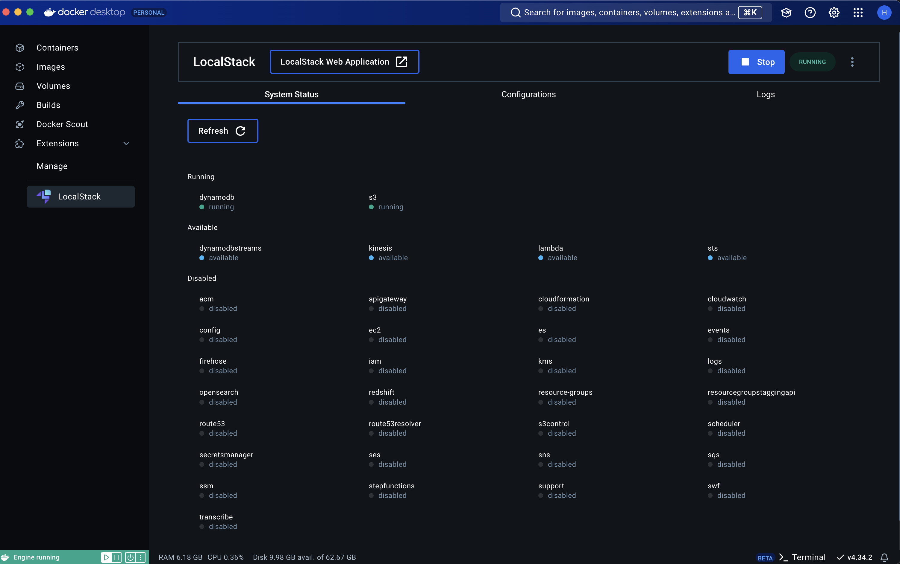

# LocalStack

LocalStackは、AWSのクラウドサービスをローカル環境で模倣するためのツール。これにより、ローカル環境でAWSのサービスを使用することができ、開発やテストに利用できる。

## LocalStackの基本情報

1. **目的**:
   - ローカル環境でAWSの様々なサービス（S3, DynamoDB, SQS, SNSなど）を模擬し、開発およびテストを容易にすること。

2. **主な利点**:
   - **コスト削減**: 本物のAWSサービスを使わないため料金が発生しない。
   - **スピード**: ローカルで動作するため、通信速度が高速。
   - **オフライン開発**: インターネット接続がなくてもAWSサービスの使用が可能。
   - **テスト容易化**: 定義された環境で一貫したテストが可能。

## MacOS上でのセットアップ方法

[LocalStack: github: DOCKER.md](https://github.com/localstack/localstack/blob/master/DOCKER.md)

1. **DockerのExtensionをインストール**
   LocalStackは、Dockerコンテナとして提供されている

   

2. **LocalStackのインストールと起動**:

   `compose.yaml`ファイル

   ```yaml
    volumes:
        localstack-data:

   services:
     localstack:
       image: localstack/localstack:latest
       container_name: localstack
       ports:
         - "4566:4566"  # Edge port
         #- "4571:4571"
         - "4510-4559:4510-4559"
       environment:
         - SERVICES=s3,dynamodb,lambda  # 使用するサービスを指定
         - DEBUG=1
         - PERSISTENCE=1
         #- DATA_DIR=/tmp/localstack/data
         #- LAMBDA_EXECUTOR=docker-reuse
       volumes:
         - localstack-data:/var/lib/localstack
         #- "${TMPDIR:-/tmp}/localstack:/tmp/localstack"
   ```

   ```sh
   docker-compose up -d
   ```

3. **AWS CLIを設定**:
   LocalStackのエンドポイントを指定するために、AWS CLIのプロファイルを設定する。

   ```sh
   aws configure --profile localstack
   # AWS Access Key ID [None]: test
   # AWS Secret Access Key [None]: test
   # Default region name [None]: us-east-1
   # Default output format [None]: json

   export AWS_PROFILE=localstack
   export AWS_ENDPOINT_URL=http://127.0.0.1:4566
   ```

## LocalStackで利用されるPort

1. **4566 (Edge Port)**
   - **概要**: LocalStackの主要なエッジポート。ほとんどのAWSサービスがこの単一のポートを通じてアクセス可能。
   - **目的**: サービスのリクエストを一つのエンドポイントで受け取るため。

[DOCKER.md](https://github.com/localstack/localstack/blob/master/DOCKER.md)を見ると、`-p 4566:4566 -p 4510-4559:4510-4559`が使われている

## LocalStackの使い方

LocalStackを使用する際、基本的なAWS CLIコマンドにエンドポイントを指定して実行する必要がある。
[AWS CLIの最新バージョンのインストールまたは更新](https://docs.aws.amazon.com/ja_jp/cli/latest/userguide/getting-started-install.html)

※ [LocalStack AWS CLI (awelocal)](https://docs.localstack.cloud/user-guide/integrations/aws-cli/#localstack-aws-cli-awslocal) というものが存在するが、これは不要？

1. **S3バケットの作成**:

   ```sh
   aws --endpoint-url=$AWS_ENDPOINT_URL s3 mb s3://my-test-bucket
   ```

2. **DynamoDBテーブルの作成**:

   ```sh
   aws --endpoint-url=$AWS_ENDPOINT_URL dynamodb create-table \
       --table-name MyTable \
       --attribute-definitions AttributeName=Id,AttributeType=S \
       --key-schema AttributeName=Id,KeyType=HASH \
       --provisioned-throughput ReadCapacityUnits=5,WriteCapacityUnits=5
   ```

3. **Dockerコンテナ+Goによる、Lambda functionのデプロイ**:

   ```sh
   # Goのプログラムを書いて、ImageでDeployしている前提
   # Docker Imageは、Docker HubもしくはECR
   # REPOSITORY: 339712726982.dkr.ecr.ap-northeast-1.amazonaws.com/dev-comm-hub-lambda-handler-repository:b8892b4-20240925T091915

   aws --endpoint-url=$AWS_ENDPOINT_URL lambda create-function \
       --function-name Health \
       --package-type Image \
       --code ImageUri=<your-dockerhub-username>/my-go-lambda:latest \
       --role arn:aws:iam::123456789012:role/lamda-ex-role
   ```

## 注意点

- 本番環境とは異なる動作をすることがあるため、本番前に必ずAWS実環境でのテストを行うことが推奨される
- LocalStackの無料バージョンには、一部制限があり、もし高度な機能が必要な場合は、LocalStack有料版を検討する

## References

- [LocalStack Docs](https://docs.localstack.cloud/overview/)
- [LocalStack Docker Extension](https://docs.localstack.cloud/user-guide/tools/localstack-docker-extension/)
- [LocalStack Lambda](https://docs.localstack.cloud/user-guide/aws/lambda/)
- [LocalStack: github](https://github.com/localstack/localstack)
  - [LocalStack: github: DOCKER.md](https://github.com/localstack/localstack/blob/master/DOCKER.md)
