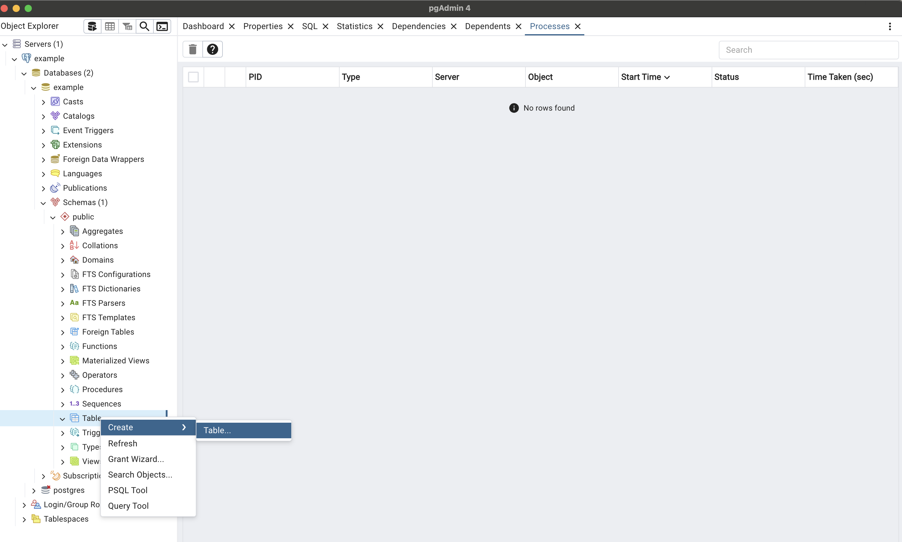

# DB設計

- Entity Relationship Diagram (ER図)
- DDL (Data Definition Language)

SQLにおける`DDL`には、データベースやテーブル、ビューなどの作成を行う`CREATE文`や、これらを削除する`DROP文`、これらの設定や構成に変更を加える`ALTER文`、テーブル中のデータを全削除する`TRUNCATE文`が含まれる

## Design Tool

### 無償
- [pgAdmin](https://www.pgadmin.org/) for PostgreSQL
- [DBeaver](https://dbeaver.io/)
- [Mermaid](https://mermaid.js.org/syntax/entityRelationshipDiagram.html)
  - [Entity Relationship Diagrams](https://mermaid.js.org/syntax/entityRelationshipDiagram.html)
  - [Mermaid with ChatGPT](https://www.mermaidchart.com/landing)
- [PlantUML](https://plantuml.com/ja-dark/ie-diagram)
- [draw.io](https://app.diagrams.net/)
  - クラス図
  - フローチャート
  - 組織図
  - スイムレーン
  - ER図
  - シーケンス図
- [SchemaSpy](https://schemaspy.org/)
- [SQL DDL to ERD diagram](https://www.devtoolsdaily.com/sql/ddl-to-diagram/)

### 有償
- [atlas](https://atlasgo.io/)
  - manage your database schema as code
  - Freeプランもある
- [DataGrip](https://www.jetbrains.com/ja-jp/datagrip/) by JetBrains
  - 有償
- [dbdiagram.io](https://dbdiagram.io/home)
  - Freeプランはかなり限定的だが、10 diagramsまでは出力できる
- [DbVisualizer](https://www.dbvis.com/)
  - 有償

## DDLからER図の自動生成ができるとよい

- DDL作成後、ChatGPTからMermaidを自動生成
- [atlas](https://atlasgo.io/)
- [dbdiagram.io](https://dbdiagram.io/home)

### [dbdiagram.io](https://dbdiagram.io/home)

- [DBML - Database Markup Language](https://dbml.dbdiagram.io/home/)
- [Crafting an Automatic ERD Generator: A Journey from DDL to Diagram](https://devtoolsdaily.medium.com/crafting-an-automatic-erd-generator-a-journey-from-ddl-to-diagram-83cc5da8cab7) ... MySQLのみ

#### DBMLの生成

DDLからDBMLに変換する必要がある

- [dbml CLI](https://dbml.dbdiagram.io/cli)
- [ローカルにおけるDB品質管理の向上：dbml/cli、dbdocs、psqldefの活用](https://zenn.dev/coffee_break/articles/25a26cc7622e8c)

Install
```sh
npm install -g @dbml/cli
```

Convert a SQL file to DBML
```
sql2dbml sample_pg.sql --postgres
```


## pgAdminによるDDL作成

[Creating Databases, Schemas, and Tables on pgAdmin](https://www.youtube.com/watch?v=6DzCWzeVFD0)



