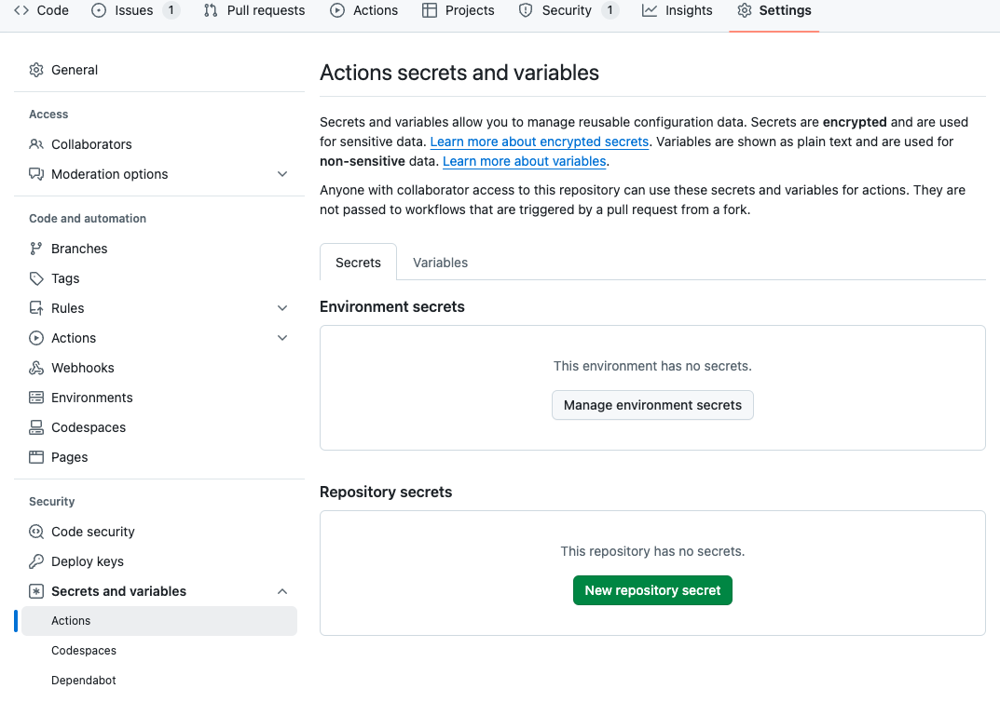

# Actions secrets and variables



## シークレット情報の追加

- `Repository secrets`の`New repository secret`から、名前と値を入力する

```yaml
- name: Deploy to AWS
    env:
    AWS_ACCESS_KEY_ID: ${{ secrets.AWS_ACCESS_KEY_ID }}
```
