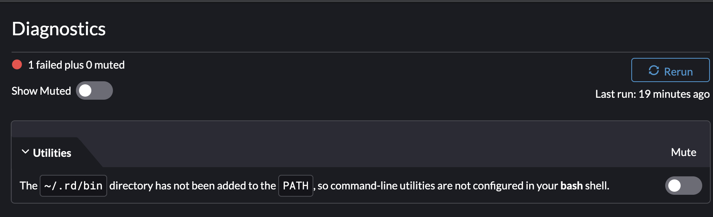
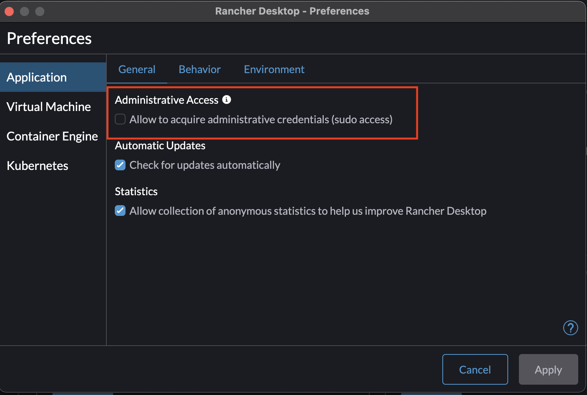

# Alternatives

Docker Desktop の代替えとなるもの

- [5 Docker Desktop Alternatives](https://hackernoon.com/5-docker-desktop-alternatives)

## [OrbStack](https://orbstack.dev/)

- [github](https://github.com/orbstack/orbstack): Star 1.8k
- [Docker Desktop for Mac 代替の OrbStack がすごい](https://ik.am/entries/746)

macOS 上で Docker コンテナと Linux マシンを高速、軽量、かつシンプルに実行する方法で、超強力な WSL と Docker Desktop の代替品であり、すべてが 1 つの使いやすいアプリにまとめられている。

## [Podman](https://podman.io/)

- [github](https://github.com/containers/podman): Star 18.2k

Podman（the POD MANager）は、コンテナやイメージ、それらのコンテナにマウントされたボリューム、コンテナのグループから作られる pod を管理するためのツール。Podman は Linux 上でコンテナを実行するが、Podman で管理された仮想マシンを使って Mac や Windows システムでも使用することができる。

## [colima](https://github.com/abiosoft/colima)

- [github](https://github.com/abiosoft/colima): Star 12.1k

Linux と macOS でのみ利用可能な Colima は、macOS 上で Linux VM を有効にするために Lima を使用している。Docker、Containerd、Kubernetes のランタイムをサポートしており、いずれの場合も Colima と並行してそのランタイムをインストールする必要がある。

## [Rancher desktop](https://rancherdesktop.io/)

- [github](https://github.com/rancher-sandbox/rancher-desktop/): Star 4.8k

Rancher Desktop は、デスクトップ上でコンテナ管理と Kubernetes を提供するアプリで、Mac（Intel と Apple Silicon の両方）、Windows、Linux で利用可能。
Rancher Desktop では、コンテナイメージを build、push、pull する機能と、コンテナを実行する機能が提供されている。これは、Docker CLI（エンジンとして Moby/dockerd を選択した場合）または nerdctl（エンジンとして containerd を選択した場合）のいずれかによって提供される。

### Install 時の注意点

- path を通す
  

- Administrative にチェックを入れる
  

- `docker-credential-desktop` 起因のエラー
  - [docs source about docker-credential-desktop](https://github.com/docker/docker-credential-helpers/issues/149)

```sh
failed to solve: error getting credentials - err: exec: "docker-credential-desktop": executable file not found in $PATH, out:
```

MacOS Apple Silicon 環境において、以下のコマンドで解決

```sh
ln -s "/Applications/Docker.app/Contents//Resources/bin/docker-credential-desktop" "/usr/local/bin/docker-credential-desktop"
```

## References

- [Docker 一強の終焉にあたり、押さえるべき Container 事情](https://zenn.dev/ttnt_1013/articles/f36e251a0cd24e)
