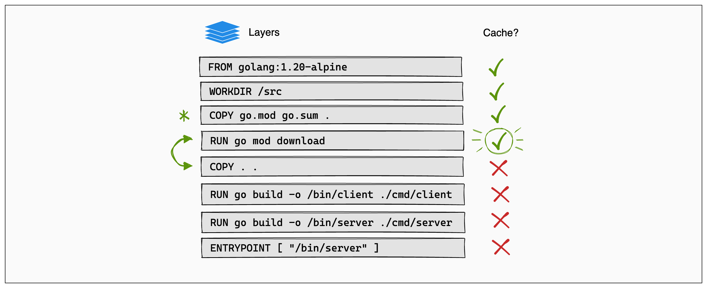

# docker build

内部 Docs の[docker-file](./docker-file.md)との境界線が曖昧なので注意

- [Build with Docker](https://docs.docker.com/build/guide/)
- [Introduction](https://docs.docker.com/build/guide/intro/)
- [Layers](https://docs.docker.com/build/guide/layers/)
  - Cached layers
  - Update the instruction order
- [Multi-stage](https://docs.docker.com/build/guide/multi-stage/)
- [Mounts](https://docs.docker.com/build/guide/mounts/)
  - cache mounts
  - bind mounts
- [Build arguments](https://docs.docker.com/build/guide/build-args/)
- [Export binaries](https://docs.docker.com/build/guide/export/)
- [Test](https://docs.docker.com/build/guide/test/)
- [Multi-platform](https://docs.docker.com/build/guide/multi-platform/)

## Layer と Cache




docker は可能な限り 構築キャッシュ build-cache を使用し、 docker build の処理を著しく高速にする。その場合はコンソール出力に `CACHED` というメッセージが表示される。

## [Multi-stage Build](https://docs.docker.com/build/guide/multi-stage/)

build step は並列で処理することができる (`Buildx Bake`でもできる)

[マルチステージ ビルドを使う](https://docs.docker.jp/develop/develop-images/multistage-build.html)

## [Export binaries](https://docs.docker.com/build/guide/export/)

```dockerfile
# syntax=docker/dockerfile:1
ARG GO_VERSION=1.21
FROM golang:${GO_VERSION}-alpine AS base
WORKDIR /src
RUN --mount=type=cache,target=/go/pkg/mod/ \
    --mount=type=bind,source=go.sum,target=go.sum \
    --mount=type=bind,source=go.mod,target=go.mod \
    go mod download -x

FROM base as build-client
RUN --mount=type=cache,target=/go/pkg/mod/ \
    --mount=type=bind,target=. \
    go build -o /bin/client ./cmd/client

FROM base as build-server
ARG APP_VERSION="0.0.0+unknown"
RUN --mount=type=cache,target=/go/pkg/mod/ \
    --mount=type=bind,target=. \
    go build -ldflags "-X main.version=$APP_VERSION" -o /bin/server ./cmd/server

FROM scratch AS client
COPY --from=build-client /bin/client /bin/
ENTRYPOINT [ "/bin/client" ]

FROM scratch AS server
COPY --from=build-server /bin/server /bin/
ENTRYPOINT [ "/bin/server" ]

FROM scratch AS binaries
COPY --from=build-client /bin/client /
COPY --from=build-server /bin/server /
```

```sh
docker build --output=bin --target=binaries .
```

## build command

```sh
docker build --help

Start a build

Usage:  docker buildx build [OPTIONS] PATH | URL | -

Start a build

Aliases:
  docker build, docker builder build, docker image build, docker buildx b

Options:
      --add-host strings              Add a custom host-to-IP mapping (format:
                                      "host:ip")
      --allow strings                 Allow extra privileged entitlement (e.g.,
                                      "network.host", "security.insecure")
      --annotation stringArray        Add annotation to the image
      --attest stringArray            Attestation parameters (format:
                                      "type=sbom,generator=image")
      --build-arg stringArray         Set build-time variables
      --build-context stringArray     Additional build contexts (e.g., name=path)
      --builder string                Override the configured builder instance
                                      (default "default")
      --cache-from stringArray        External cache sources (e.g.,
                                      "user/app:cache", "type=local,src=path/to/dir")
      --cache-to stringArray          Cache export destinations (e.g.,
                                      "user/app:cache", "type=local,dest=path/to/dir")
      --call string                   Set method for evaluating build ("check",
                                      "outline", "targets") (default "build")
      --cgroup-parent string          Set the parent cgroup for the "RUN"
                                      instructions during build
      --check                         Shorthand for "--call=check" (default )
  -f, --file string                   Name of the Dockerfile (default:
                                      "PATH/Dockerfile")
      --iidfile string                Write the image ID to a file
      --label stringArray             Set metadata for an image
      --load                          Shorthand for "--output=type=docker"
      --metadata-file string          Write build result metadata to a file
      --network string                Set the networking mode for the "RUN"
                                      instructions during build (default "default")
      --no-cache                      Do not use cache when building the image
      --no-cache-filter stringArray   Do not cache specified stages
  -o, --output stringArray            Output destination (format:
                                      "type=local,dest=path")
      --platform stringArray          Set target platform for build
      --progress string               Set type of progress output ("auto", "plain",
                                      "tty", "rawjson"). Use plain to show
                                      container output (default "auto")
      --provenance string             Shorthand for "--attest=type=provenance"
      --pull                          Always attempt to pull all referenced images
      --push                          Shorthand for "--output=type=registry"
  -q, --quiet                         Suppress the build output and print image ID
                                      on success
      --sbom string                   Shorthand for "--attest=type=sbom"
      --secret stringArray            Secret to expose to the build (format:
                                      "id=mysecret[,src=/local/secret]")
      --shm-size bytes                Shared memory size for build containers
      --ssh stringArray               SSH agent socket or keys to expose to the
                                      build (format:
                                      "default|<id>[=<socket>|<key>[,<key>]]")
  -t, --tag stringArray               Name and optionally a tag (format: "name:tag")
      -target string                 Set the target build stage to build
      --ulimit ulimit                 Ulimit options (default [])

Experimental commands and flags are hidden. Set BUILDX_EXPERIMENTAL=1 to show them.
```

## よく使うコマンド

### build cache のクリア

```sh
docker builder prune -af
```

## Docker buildx

[buildx](https://github.com/docker/buildx) is a Docker CLI plugin for extended build capabilities with BuildKit.

BuildKit サーバは Docker engine に組み込まれて提供されており、default ではその組み込まれた BuildKit サーバコンポーネントを利用する。

### BuildKit の利点

- 使用していない 構築ステージ の検出とスキップ
- 独立している構築ステージを 並列構築 parallelize building
- 構築コンテキストと構築の間では、変更のあったファイルのみ転送
- 構築コンテキスト内で、未使用ファイルの検出と、転送のスキップ
- 多くの新機能がある 拡張 Dockerfile 実装 external Dockerfile implementations を使用
- 他の API （中間イメージとコンテナ）による副作用を回避
- 自動整理 automatic pruning のために、構築キャッシュを優先度付け

### BuildKit バックエンドを使う

`docker build` を実行する前に、CLI 上で環境変数 `DOCKER_BUILDKIT=1` を設定する

### [Buildx Bake](https://docs.docker.com/build/bake/)

複数のイメージを並列でビルドする
