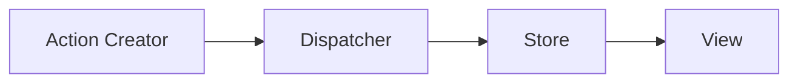

# Flux
FluxはReactと組み合わせて使われるSPA構築のためのアプリケーション・アーキテクチャで、コンポーネント間のデータとアクションの一方向の流れを重視するもの  

公式サイトには、
```
The Flux project has been archived and no further changes will be made. We recommend using modern alternatives like Redux, MobX, Recoil, Zustand, or Jotai instead.
```
とあるため、Reduxなどのアーキテクチャーを参考にしたほうがいい。

## References
- [Official](https://facebookarchive.github.io/flux/)
- [github:flux](https://github.com/facebookarchive/flux)
- [An introduction to the Flux architectural pattern](https://www.freecodecamp.org/news/an-introduction-to-the-flux-architectural-pattern-674ea74775c9/)

## Flux architectural pattern

### 4つのパーツ
- Stores
- Dispatcher
- Views
- Action / Action Creators

### Stores
- Storeは状態を管理する
- Domainの状態とUIの状態を保存する
- StoreはState(状態)とは異なる概念で、Stateはデータの値となる
- StoreはメソッドでStateを管理するためのObject
- Storeは複数のObjectを管理し、それらのObjectの唯一の情報源となる
- Applicationには複数のStoreが存在することもある
- Storeにセッターメソッドは存在せず、`Dispatcher`にActionを渡すことで、状態を変更することができる
- StoreはEvent Emitterとしても働く

### Dispatcher
- 登録されたすべてのStoreにAction/Eventをブロードキャストする単一のObject
- StoreはApplication起動時にEvent登録を行う必要がある
- Actionが通知されたら、そのActionを登録している全てのStoreに渡されることになる

### Views
- UIコンポーネントで、UIのRenderingとユーザーのインタラクションを処理する役割を持つ
- ViewはTree構造となっている
- ViewはStoreの変更をlistenし、再レンダリングする
- Viewは、`Presentation View`と`Container View`に分けられる
- `Container View`のみが、StoreとDispatcherと連携する
- `Container View`はStoreからのEventを受け取り、`Presentation View`にデータを提供する

### Action / Action Creators
- ActionはそのActionの種類を示す`type`プロパティがある
- ActionオブジェクトはApplication内の至る所で使われるため、immutableにしておく
- Actionを作成し、Dispatchする関数を`Action Creators`と呼ぶ

#### Web API Call
- UIを更新するためにWeb `API Call`を行う場合、`Web API Call`に続いてStoreを更新するActionが発生する
- Storeが更新されると`changeイベント`が発行され、その結果、そのEventをListenしているViewが再レンダリングされる
- `Web API Call`は`Action Creators`で行われる

## 単方向のデータフロー (Unidirectional data flow)
- 更新するビューの流れは単一方向となる


### Store Reads

### Store Writes in synchronous actions

### Store Writes in asynchronous actions


## Pros
- Fluxアーキテクチャは、ViewがDomain Storeに直接マッピングされないようなアプリケーションにより適している
- これは、Viewが多くのストアを更新するActionを作成でき、Storeが多くのViewを更新する変更をトリガーできる場合
- Actionを永続化し、再生することができる

## Cons
- Fluxは、各Viewが1つのStoreにマッピングされるようなアプリケーションに不必要な複雑さを加える可能性がある
- このようなアプリケーションでは、ViewとStoreの分離で十分