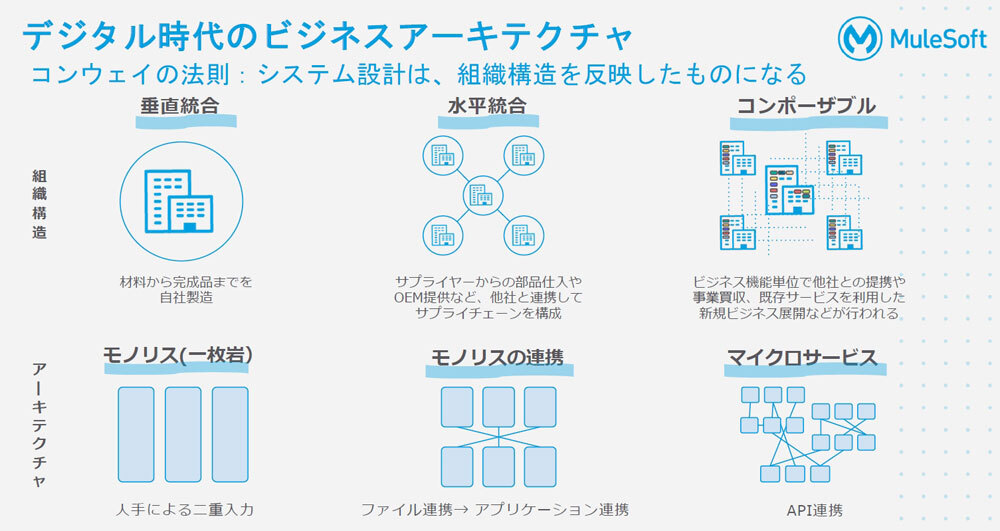

# Backends For Frontends (BFF)

Backend for Frontend（BFF）はウェブ、モバイル、その他のプラットフォームなど、異なるクライアントやユーザーインターフェース向けに API を調整するパターンである。すべてのクライアントに単一の API を提供するのではなく、BFF は各クライアント固有のニーズや要件に対応するカスタマイズされた API を提供し、効率的なコミュニケーションと最適化されたユーザー体験を保証する。

また、ソフトウェア開発においてコンポーザブル・アーキテクチャを構築するための効果的なソリューションである。このパターンは、マイクロサービス・アーキテクチャの利点を維持しながら、ウェブ、モバイル、IoT デバイスなど、さまざまなクライアント・プラットフォームの固有の要件に対応する。

SoundCloud の Phil Calcado によって初めて紹介された BFF パターンは、各クライアント・プラットフォームに合わせたカスタム・バックエンド・サービスの作成を提案している。これらのバックエンドサービスは、フロントエンドと基礎となるマイクロサービス間の仲介役として機能し、各プラットフォームの特定の要件を満たすようにデータを集約し、変換する。その結果、フロントエンドの開発が簡素化され、パフォーマンスが向上し、保守性が向上する。

## cBFF とは？

Composable Backend for Frontend（cBFF）は、API Repository を活用して、複数の Service API、Vendor API、データソースを統合した BFF API を構成する BFF パターンの実装方法。これにより、コンポーザブル・アーキテクチャーを目指す場合、より柔軟でスケーラブルな BFF の実装方法が可能になる。

## コンポーザブル・アーキテクチャを構築する際、BFF パターンが他のソリューションよりも好まれる理由

### プラットフォーム要件への適応性

BFF パターンにより、開発者は各プラットフォーム独自の要件、データ形式、インタラクション・パターンに対応したバックエンド・サービスを作成することができ、より良いユーザー体験と効率的なリソース利用につながる。

### 懸念の分離

データの集約と変換タスクをバックエンドに委譲することで、BFF パターンはフロントエンドとバックエンドの開発における懸念事項の明確な分離を促進する。

### 柔軟性と保守性

BFF パターンは、クライアント・プラットフォームごとにバックエンド・サービスの独立した開発、デプロイメント、スケーリングを可能にし、他のプラットフォームやサービスに影響を与えることなく、変化する要件への迅速な適応を促す。

### パフォーマンスの最適化

各フロントエンドに専用のバックエンドを提供することで、BFF パターンはデータの集約、変換、キャッシュを最適化し、待ち時間の短縮、ペイロードサイズの縮小、全体的なパフォーマンスの向上を実現する。

### API 進化の合理化

BFF パターンは API の進化管理を簡素化する。開発者は他のプラットフォームに影響を与えることなく、新機能の導入、変更、古い機能の廃止ができる。

## 類似のソリューション

BFF パターンには多くの利点があるが、すべての状況に適しているとは限らない。クライアント・プラットフォームが非常に類似していたり、数が少なかったりする場合には、`API Gateway`や`GraphQL`のような代替ソリューションがより適切かもしれない。

## BFF アーキテクチャーを導入するには？

各クライアントに公開したいサービスごとに固有の API を実装することで、BFF アーキテクチャを作成できる。これは、各クライアントに固有の API を作成するか、各サービスに固有の API を作成し、それらの API を各クライアントに単一の API としてまとめることで実現できる。コンポーザブル・アーキテクチャーを目指す場合、BFF をより柔軟かつスケーラブルに実装することができるため、後者を推奨する。

気をつけなければならないのは、デバイス（iOS、Android、Web）ごとに API を作成するのではなく、デバイスの種類（Mobile、Web、Public API）ごとに API を作成すること。

## BFF はいつから使うべき？

[WunderGraph](https://wundergraph.com/)を使って API の作成を開始し、ユースケースに応じて複数の WunderNode 設定を作成することができる。これにより、カスタマイズされたサービスレベルの API を作成したり、クロスクライアント API を重複させる必要がなくなる。

あるいは、複数のクライアントが同じサービスを利用する必要がある場合に、BFF を使い始めることになる。これは一般的に、ウェブアプリケーションとモバイルアプリケーションの両方が同じサービスを利用する必要がある場合。手始めに、各サービス用の API を作成し、それらの API を各クライアント用に 1 つの API にまとめる。

## [API Gateway と Backend For Frontend の比較](https://kuroco.app/ja/blog/api-gateway-vs-backend-for-frontend/)

`API Gateway`は、システム内のリソースにアクセスしようとするすべてのクライアントのエントリーポイント。一方、`Backend For Frontend（BFF）`は、通常、複数のフロントエンドに対応する複数の BFF がある特定のフロントエンドに合わせて作成される。

### API Gateway とは？

API Gateway は、すべてのクライアントがシステム内のリソースにアクセスしようとする際に通過するフィルター。API ゲートウェイは、`リバースプロキシ`として機能し、すべてのアプリケーションプログラミングインターフェース（API）呼び出しを受け入れ、それらを満たすために必要なさまざまなサービスを集約し、適切な結果を返す。

### BFF と API Gateway の違いは？

BFF は実際には API Gateway の一種。実際、両者は同じ機能を果たすが、主な違いは範囲、つまりどれだけのクライアントと対話するか。`BFF`は特定のクライアントに合わせて作成されるため、通常はアプリケーションのフロントエンドビューに対応する。一方、`API Gateway`は、ほとんどの（またはすべての）クライアントがデータにアクセスするための単一のゲートウェイとして機能する。

要約すると、主な違いは`どれだけのクライアントに対応するか`。標準の API Gateway は、システムと対話するすべてのクライアントのリクエストを処理するが、BFF は特定のクライアントのみを処理する。

### Composable アーキテクチャ

コンポーザブル（Composable）とは、直訳すると「複数の要素や部品などを結合して、構成や組み立てが可能な」の意になる。従来からのモノシリックなシステムをコンポーネントに分割して組み換え（コンポジション）を容易にするとともに、コンポーネントごとの変更を通じて他システムへの影響を排除することで、安全かつ迅速、しかも効率的なシステムの見直しを可能とするアーキテクチャーのこと。`変化に強い`インフラ構築技術の 1 つ。

## References

- [BFF Patterns](https://bff-patterns.com/)
- [AWS: Backends for Frontends パターン](https://aws.amazon.com/jp/blogs/news/backends-for-frontends-pattern/)
