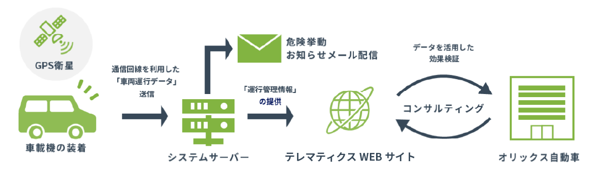

# テレマティクス: Telematics

`テレコミュニケーション（通信）`と`インフォマティクス（情報工学）`を組み合わせた造語。自動車などの移動する媒体に通信技術を組み合わせてリアルタイムに双方向で情報を通信し、「つながる」ことで新しいサービスを提供することが可能となる技術のこと。テレマティクスは、モノのインターネットこと「IoT」の一種。

自動車の IoT 化では、主に自動車本体やドライブレコーダーなどの搭載機器を IoT 化することで、GPS から測定された位置情報や走行データ、走行速度などのさまざまな情報をクラウド上で確認・管理し、企業の車両管理に役立てられており、車両運行システムや運転支援システムなどのサービスもある。

## テレマティクス保険

テレマティクスを活用したサービスとして最も代表的で、テレマティクスで記録された日々の運転情報を保険会社が取得・評価し、保険料に反映するサービス。テレマティクス保険には、`走行距離連動型`と`運転行動連動型`の 2 種類がある。`走行距離連動型`は、走行距離の短さに応じて保険料を算定するのに対し、`運転行動連動型`は走行速度や急ブレーキ、急停止といった運転特性を判定し、安全運転の有無によって事故リスクを分析し、保険料を算定する仕組みとなっている。運転行動連動型では、より安全な運転を行っていると保険料が安くなるが、反対に危険な運転特性がみられると保険料は高くなる。そのため、安全運転の促進や事故の削減につながると注目されている保険となる。

## [あいおいニッセイ同和損保: テレマティクス損害サービス](https://www.aioinissaydowa.co.jp/corporate/service/telematics_claims_service/)

映像・位置情報・加速度情報などを中心としたデジタルデータの活用による革新的かつ高度な事故対応を行うことができる。「交通事故のさらなる減少」へ貢献することを目指し、`事故予防`と`事故サポート`を提供する。

特徴として、

- 各種デジタルデータから車両の大きな衝撃を検知し、保険会社から client へ能動的に連絡する「発信型」への変革により、迅速かつ的確なサポートによる事故受付を実現する
- client による事故場所・状況等の情報をもとにした「推測」から、上述の各種デジタルデータの可視化による「視認」へと変革

### 機能: 万が一の事故時のサポート

- 事故緊急自動通報サービス
  - 自動的にコールセンターへ通知
- 専任オペレータから安否確認コール & サポート
  - レッカー手配
  - 救急車の出動依頼
  - 事故受付
  - レンタカー手配

### 機能: 事故後の対応の負担軽減, 迅速かつ適切な事故対応

- 事故時には損保会社の`車載器`、または`テレマティクス端末`から車の`位置情報`・`速度`などが自動で送信される。
- `ドライブレコーダー型商品`を契約されている場合は、`事故映像`も自動送信される。
  - 事故状況を AI で解析 (ドライブレコーダー型商品が必要)
  - `常時録画`と`イベント記録`
- `コネクテッドカー`から得られる走行データを活用した事故対応サービス
  - コネクテッドカーから自動で送信される車の`位置情報`・`速度`などのデータを事故対応にも活用
  - G センター
  - ハンドル
  - アクセル
  - ブレーキ
  - シフト
  - 方向指示器
  - ヘッドライト
  - 自動ブレーキ

### 機能: 安全運転のサポート

- おそらく、`コネクテッドカー`から得られる走行データは Database に登録される
- 法人管理者機能(画面)からからレポートを作成する

## [オリックス自動車: 運行管理: Safe Driving Management](https://www.orix.co.jp/auto/service/operation/)

### サービス一覧

- リスクコンサルティングサービス
  - 安全運転講習会
  - e-ラーニング
  - 実技教習
  - DR 映像解析サービス
- テレマティクスサービス
  - 車両に`車載機`と`GPS`を装着し、通信回線を通じて取得した`車両運行データ`を有効な情報に加工して WEB 上で提供するサービス
  - 事故防止や CO2 削減に寄与する運転コンサルティングを実施する
- AI 搭載通信型ドライブレコーダー
  - 「わき見」「居眠り」などの危険運転を AI が察知し、リアルタイムでアラートを鳴らし事故の未然防止を図る

## [東京海上日動: ドライブエージェント パーソナルについて](https://www.tokiomarine-nichido.co.jp/service/auto/total-assist/shohin/dap.html)

通信機能付きオリジナルドライブレコーダーを活用したテレマティクスサービス

### サービス

- 高度な事故対応サービス
  - ドライブレコーダーが強い衝撃を検知し、自動で事故受付センターに連絡
  - 事故直後の現場対応をサポート
  - 事故状況再現システムで client のご負担を軽減
- 事故防止支援サービス
  - 危険地点接近警告
  - 片寄り警告&前方車両接近警告
  - わき見・居眠り警告
  - SOS 発信機能
- 安全運転診断サービス
  - 紙レポート(年 1 回更新)
  - WEB レポート(毎月更新)

## [コネクテッドカー](https://www.soumu.go.jp/johotsusintokei/whitepaper/ja/h27/html/nc241210.html)

ICT 端末 (Information and Communication Technology) としての機能を有する自動車のことであり、車両の状態や周囲の道路状況などの様々なデータをセンサーにより取得し、ネットワークを介して集積・分析することで、新たな価値を生み出すことが期待されている。具体的には、事故時に`自動的に緊急通報を行うシステム`や、`走行実績に応じて保険料が変動するテレマティクス保険`、`盗難時に車両の位置を追跡するシステム`等が実用化されつつある。
自動車にはこれまでも、カーナビや ETC 車載器などの通信機器が搭載されてきたが、近時コネクテッドカーへの注目が高まっている背景としては、以下の各点を挙げることができる。

- 無線通信の高速・大容量化
- 車載情報通信端末の低廉化、スマホによる代替化
- ビッグデータの流通の大幅な増加

### コネクテッドカーの実現するサービス

#### 緊急通報システム

#### コネクテッドカー: テレマティクス保険

欧米の保険会社は、利用者の運転中の行動（ブレーキの回数や加減速動作など）や時間帯を収集し、利用者の運転行動・振る舞い（How）に基づき運転の危険度を評価し、保険料を策定する`PHYD（Pay How You Drive）`を提供している。たとえば、Progressive、State Farm、National General Insurance といった米国企業は、走行距離、速度、時間帯等を記録し、運転行動・振る舞いに応じて保険料を算定している。一方、CIS や Insure the box といった英国企業は、上記に加えて GPS を活用した位置情報等を収集することで、制限速度超過、危険の多い道路の走行割合などを含めて保険料を策定している。

日本においてもテレマティクス保険が本格的に普及しつつある。あいおいニッセイ同和損害保険では、トヨタ自動車と連携し、車載テレマティクス端末から得られた走行距離に連動して保険料を算出する PAYD（Pay As You Drive）型のテレマティクス保険「つながる自動車保険」を 2015 年 4 月以降の契約から提供している。「つながる自動車保険」では、実際の走行距離を 1km 単位で保険料に反映する。運転の時間帯、走行距離・燃費等の情報も取得・分析しているが、PHYD 型の保険とは異なり、保険料には反映させず、安全運転に関するアドバイスサービスの提供を行うにとどめている。ソニー損保では、2015 年 3 月以降の契約を対象に、急発進・急ブレーキの発生状況とそのリスクにより保険料を算出する PHYD 型のテレマティクス保険「やさしい運転キャッシュバック型」の提供を開始している。

#### 盗難車両追跡システム

## References

- [パイオニア: 今話題のテレマティクスとは](https://mobility-service.pioneer.jp/contents/telematics/)
- [What is telematics?](https://www.geotab.com/blog/what-is-telematics/)
