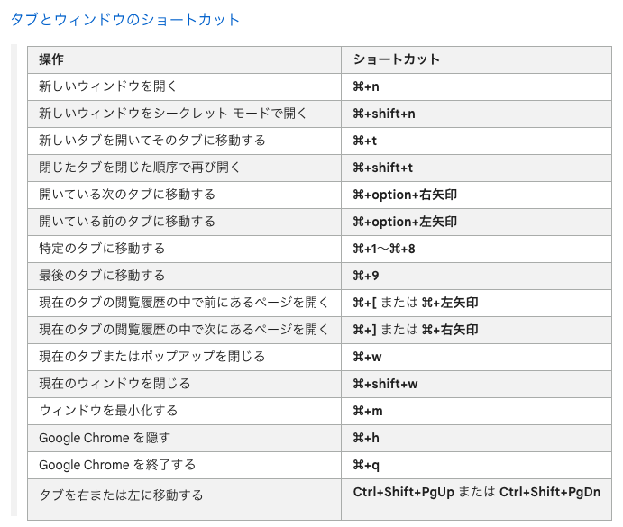
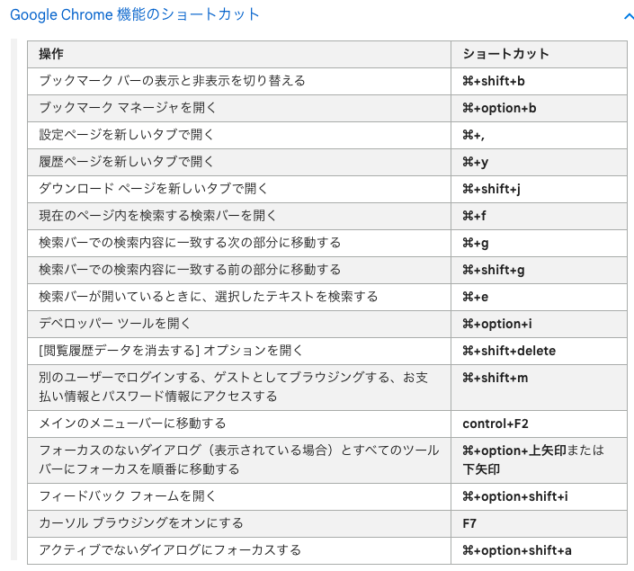
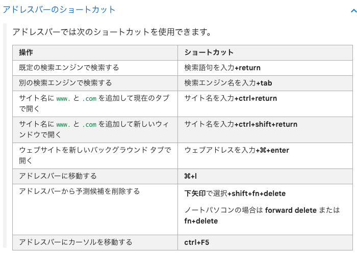
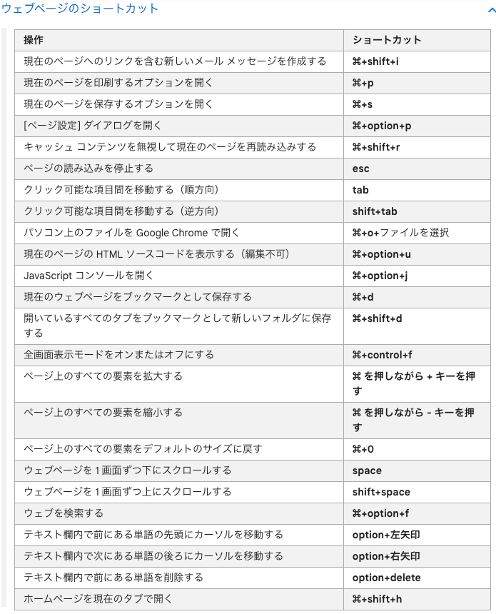
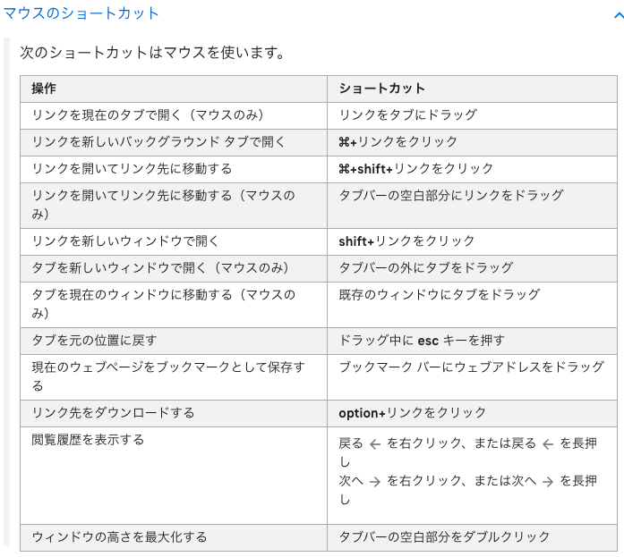

# MacOS Keyboard

- [Mac のキーボードショートカット](https://support.apple.com/ja-jp/HT201236)

## My Personal Keyboard

- Keychron K3

## よく使う操作 通常

- ワークスペース切り替え
  - Ctrl + 矢印
- 最前面の Window を Dock にしまう
  - Command + M
- 最前面の Window を閉じる
  - Command + W
- Spotlight Search
  - Command + Space
- 全画面表示
  - Control + Command + F
- 開いている App のうち、最近使った順番で次にあたる App に切り替える
  - Command + Tab
- 使用中の App のウインドウを切り替える
  - Command + 低アクセント (`) (通常は、「tab」キーの上、数字「1」の左側にあるキー)
- Finder で新しいフォルダを作成する
  - Shift + command + N
- 最前面の App の環境設定を開く
  - Command + カンマ (,)

### 書類に関するショートカット (VSCode では該当しなさそう)

- 「スペルと文法」ウインドウを表示
  - Shift + Command + コロン (:)
- 書類内でスペルに誤りのある単語を検索
  - Command + セミコロン (;)
- 挿入ポイントから、行または段落の末尾までの範囲にあるテキストを削除

  - Control + K

- 挿入ポイントを書類の先頭に移動
  - Command + 上矢印　（Ctrl + A)
- 挿入ポイントを書類の末尾に移動
  - Command + 下矢印 (Ctrl + E)
- 挿入ポイントを現在の行の先頭に移動
  - Command + 左矢印
- 挿入ポイントを現在の行の末尾に移動
  - Command + 右矢印
- 挿入ポイントを前の単語の先頭に移動
  - Option + 左矢印
- 挿入ポイントを次の単語の末尾に移動
  - Option + 右矢印
- 挿入ポイントの行を上下に移動
  - Option + 上下矢印
- テキストの選択
  - Shift + 矢印キー
- インデントの調整
  - Command + { or }
- 選択した項目のサイズを拡大縮小
  - Shift + Command + プラス記号 or マイナス記号

## Chrome

- [Chrome のキーボード ショートカット](https://support.google.com/chrome/answer/157179?hl=ja&co=GENIE.Platform%3DDesktop)

## VSCode
