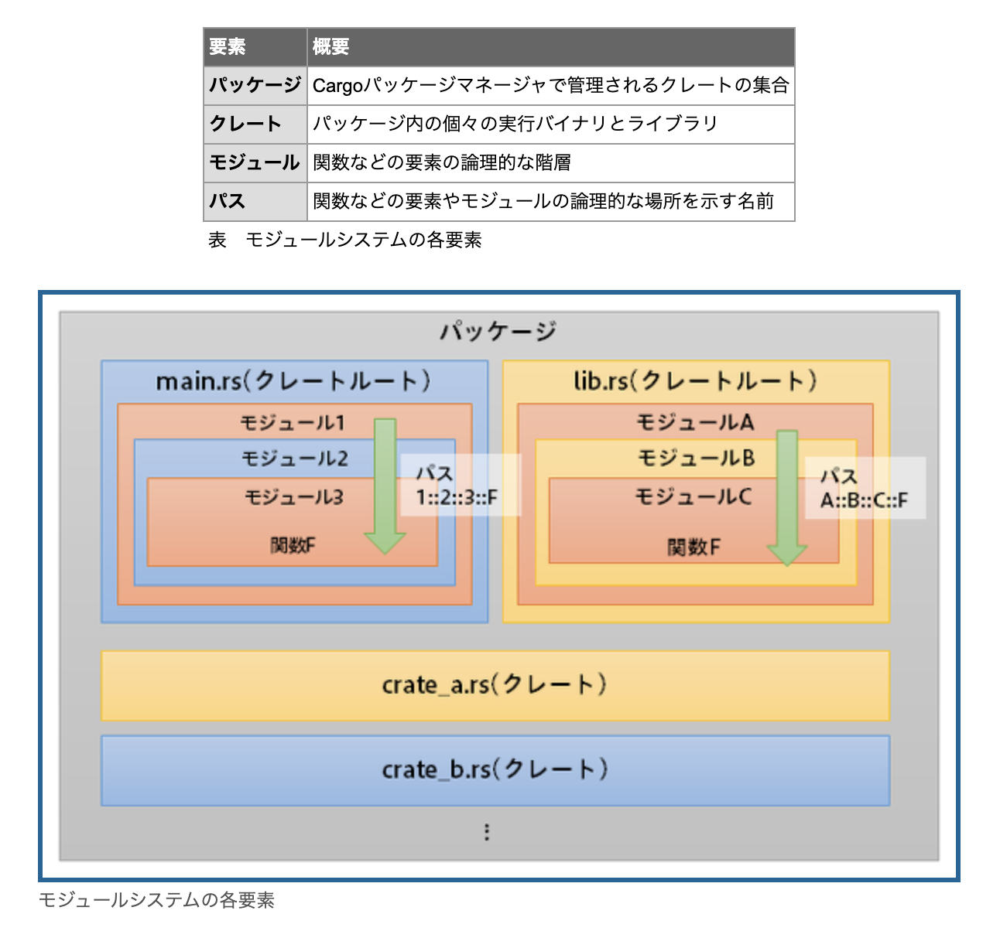

# モジュール Module



## モジュールの公開と非公開

- あらゆる要素(関数、メソッド、構造体、enum、モジュール及び定数)は標準では`非公開`
- `pub`キーワードで公開する

## モジュールのパス

`絶対パス`での指定と`相対パス`での指定が可能だが、`絶対パス`による指定のほうが好ましい

```rs
mod front_of_house {
  pub mod hosting {
    pub fn add_to_waitlist() {}
  }
}

// eat_at_restaurant()は`front_of_house`モジュールと同一モジュール内に定義されているため、
// `front_of_house`は公開されていなくても、アクセスできる
pub fn eat_at_restaurant() {
  // 絶対パス
  crate::front_of_house::hosting::add_to_waitlist();

  // 相対パス
  front_of_house::hosting::add_to_waitlist();
}
```

## `use`キーワード

これによりパスをスコープに import する

```rs
mod front_of_house {
  pub mod hosting {
    pub fn add_to_waitlist() {}
  }
}

// 関数の場合、関数の親モジュールまでをuseで持ち込む
// 関数まで持ち込むと、localで定義されているのか外部なのか、どこで定義している関数なのか不明瞭になる
use crate::front_of_house::hosting;

pub fn eat_at_restaurant() {
  hosting::add_to_waitlist();
}
```

```rs
// 構造体やenum、その他の要素をuseで持ち込む場合は、フルパスを書くのが慣例
use std:: collections::HashMap;

fn main() {
  let mut map = HashMap::new();
  map.insert(1, 2);
}
```

```rs
// pattern 1
use std::cmp::Ordering;
use std::io;
// 以下は同じ意味となる
use std::{cmp::Ordering, io};

// pattern 2
use std::io;
use std::io::Write;
// 以下は同じ意味となる
use std::io::{self, Write};
```

### glob 演算子

```rs
// あまり推奨されていないが、testでは使われることがある
use std::collections::*;
```

### `super`と`self`と`crate`

- `super`は兄弟モジュール(同じ親を持つモジュール)の参照
  - `super::sibling_module::some_item`, `use super::*;`
- `self`は現在のモジュールから見てサブモジュールのアイテムを参照
  - `use self::submodule::some_item;`
- `crate`はクレートの top level からのモジュールのパスを参照
  - `crate::root_module::some_item;`

## TODO: モジュール分割

- src/lib.rs

```rs
mod front_of_house; // 外部ファイルのモジュールを宣言

use crate::front_of_house::hosting;

pub fn eat_at_restaurant() {
  hosting::add_to_waitlist();
}
```

- src/front_of_house.rs

```rs
pub mod hosting {
  pub fn add_to_waitlist() {}
}
```

## References

以下がわかりやすい

- [Clear explanation of Rust’s module system](https://www.sheshbabu.com/posts/rust-module-system/)
- [Rust: モジュールのベストプラクティス](https://zenn.dev/msakuta/articles/83f9991b2aba62)
