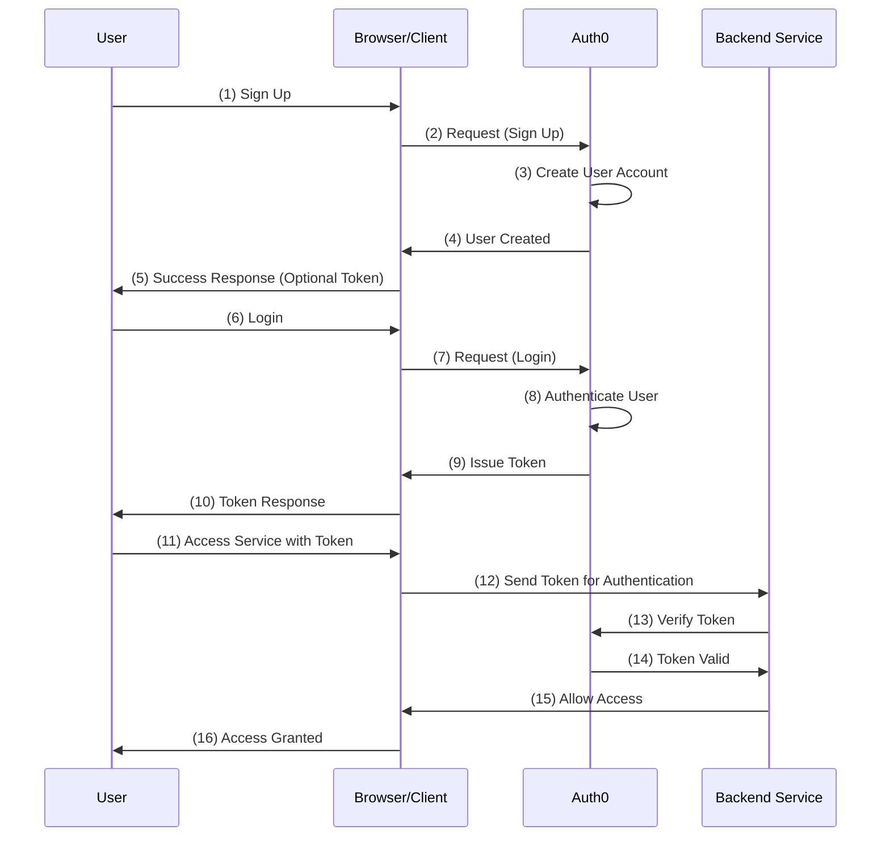

# Auth0

[Auth0](https://auth0.com/jp)

サーバーレスアーキテクチャを用いた`認証クラウドサービス（Identity as a Service, IDaaS）`で、認証基盤そのものをサービスとして提供するソリューション。自社で実装すると手間の掛かる、ユーザのログイン情報やトークンの管理をなどを簡単におこなうためのサービス。
Oktaに買収されているが、それぞれ異なるサービスとなり、Oktaは大規模エンタープライズ環境向け、Auth0は小規模企業向けとなる。

Auth0 platform側でパスワードは管理されるため、自身のサイトでPassword情報は保持する必要はない。

## 機能

### シングルサインオン(SSO)

シングルサインオンは、一度のユーザ認証処理で、Webサービス、アプリ、クラウドサービスなど独立した複数のソフトウェアシステム上にてログインできるようにする機能。
この機能によって、「Google Workspace」や「Microsoft 365」などの利用頻度の高いサービスに簡単にログイン可能。
複数サービスのIDやパスワードを管理する手間が省けるため、余計なストレス削減や業務効率アップに繋がる。

### ユニバーサルログイン

ユニバーサルログインは、中央認証サーバー経由でユーザーを認証する方法。
ユーザーエクスペリエンスの簡略化、アプリ統合の効率化、管理の改善、認証セキュリティの向上といった利点がある。
複数の多要素認証を組み合わせて利用することでより強固なセキュリティ対策にもなる。

### アダプティブ多要素認証（Adaptive MFA）

「Google Authenticator」や「Duo」を活用することで多要素認証も実現可能。
また、IDやパスワードの入力だけでログインするのではなく、SMSを利用したワンタイムパスワード、指紋認証や顔認証などユーザーの生体認証を活用することで、より本人認証の精度を高められる。

## 使用例

- Web Applicationの認証
- シングルサインオン（SSO）
- API保護
- モバイルアプリケーションの認証
- IoTデバイスの認証
- 企業内システムのセキュリティ強化

## Applicationへの導入手順

1. [Auth0 accountの作成](https://auth0.com/)
2. Auth0のダッシュボード内

   - 新しいApplicationを作成する (ApplicationのTypeも入力)
   - 認証成功後、callbackする自身のアプリケーションのURLを設定。ログアウトも同様。
   - 必要に応じて、UserのRoleやPermissionの設定
   - Loginページの設定

3. 認証成功後はjwtが取得できるので、自身のアプリケーションのBandend側のEndpointに対して、Validation機能をSDKを使って実装する
4. Auth0の[`Token Storage`](https://auth0.com/docs/secure/security-guidance/data-security/token-storage)の導入？

## シーケンス図

## 新規ユーザー登録時について

自身のアプリケーションの新規登録画面から、Auth0のsign-upページにリダイレクトする。つまり登録処理はAuth0上で実行される。
それとは別にSDKを組み込むことによって、自身のサイトから登録することもできる。

## Auth0 SDK

- [go-auth0](https://github.com/auth0/go-auth0)
