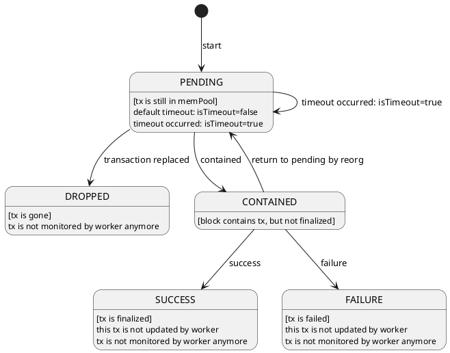

# UML (Unified Modeling Language)

統一モデリング言語 (UML) は、ソフトウェアエンジニア開発の世界において、ビジネスユーザーを始め、システムを理解しようとするあらゆるユーザーが理解できる視覚化のための共通言語を打ち立てることを目的のために作られたモデリング手法

## Tools

- [PlantUML](https://github.com/plantuml/plantuml)
- [Mermaid](https://mermaid.js.org/#/)
  - Github の Markdown ファイルに「Mermaid」で図を挿入可能

## TODO: 状態遷移図

- [状態遷移図とは?](https://jp.mathworks.com/discovery/state-diagram.html)

