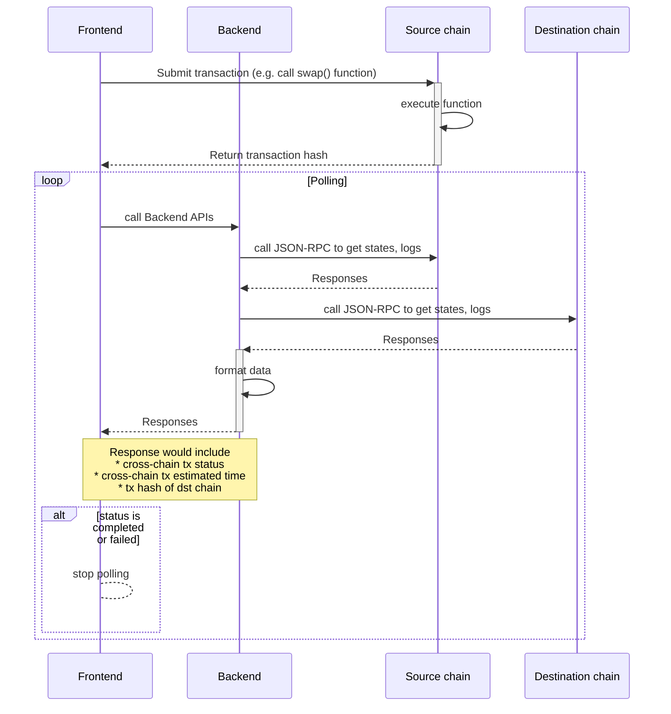
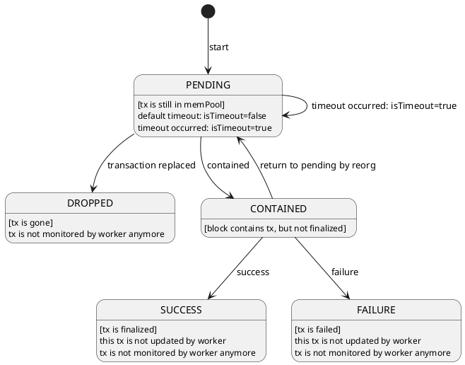

# Mermaid

Github の Markdown ファイルに「Mermaid」で図を挿入可能

- [Official](https://mermaid.js.org/#/)
- [Live Editor](https://mermaid.live/)
- [VS Code Marketplace for mermaid](https://marketplace.visualstudio.com/search?term=mermaid&target=VSCode&category=All%20categories&sortBy=Relevance)

## シーケンス図

## TODO: 状態遷移図

- [状態遷移図とは?](https://jp.mathworks.com/discovery/state-diagram.html)

